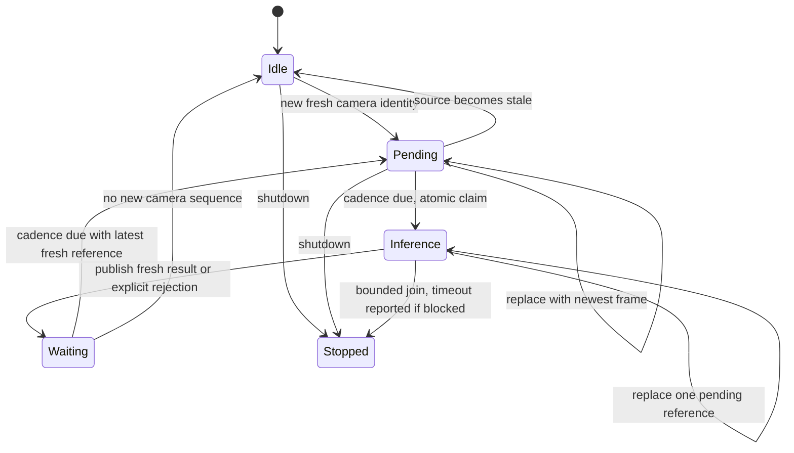
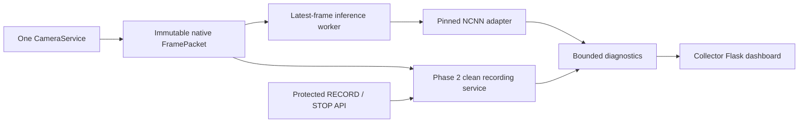

# Squirrel Squirter Phase 3 handoff — 2026-09-07

1. **True v3 best epoch:** 149. The best weights equal epoch 149's saved state and differ from final epoch 150.
2. **Exact best AP50–95:** 0.6256842839174807 on the unchanged external validation.
3. **Compared with v2:** +0.008959481548421855, or +0.8959481548421855 AP percentage points. A modest improvement; no statistical significance or garden/field improvement claim.
4. **Best checkpoint SHA-256:** `5d8b78244107302881477bda95353236f29356c23a2a10f61936225c4dfc4831`.
5. **NCNN export:** Successful, CPU FP32 416x416; no architecture change or quantization.
6. **Source-vs-NCNN equivalence:** PASS on 22 approved non-protected/synthetic inputs with the original v2 tolerances.
7. **Final artifact hashes:** param `18f83f0d8450e65f3adc131d2633036cef51a3d872b99058f6e284d2bce93620`; bin `78e7c91742549a04ba05e306734e0e395b386d9709b8446eb5b0ba9112f4b939`.
8. **Manifest/runtime contract:** Strict schema v1, exactly squirrel, BGR top-left 114 letterbox, CHW FP32/no scaling, in0/out0 raw [3549,6], strides 8/16/32, objectness times class, class-agnostic NMS 0.65, NCNN 1.0.20260526, collector role. Independently pinned manifest hash plus startup artifact/equivalence hashes; readiness is explicit.
9. **Real offline runtime load:** PASS. The actual runtime adapter replayed all 22 inputs with unchanged pixels and fresh bundle validation.
10. **~2 Hz worker:** One inference owner and one newest pending reference; no FIFO backlog.
11. **Catch-up bursts:** No. Stale work drops; an inference spanning a cadence interval schedules its next opportunity one interval after completion.
12. **Exact identity:** Every result includes source generation/sequence/native geometry/times and loaded model/version/checkpoint/manifest/artifact identity. Failure before model identification is explicitly unavailable with null model identity.
13. **Collector hardware authority:** None in the explicit composition. It does not construct/call servo, valve, ManualControlService, AutoFireService, GPIO or PCA9685. Injected tests prohibit these factories, including with legacy control flags enabled.
14. **Recording without hardware:** Yes. Manual RECORD/STOP reuses the Phase 2 clean recorder. Detector-triggered extension remains unconnected; source-time extension is tested using a fake observation without asserting a biological visit.
15. **Telemetry/API:** Dedicated collector dashboard; /api/status, /api/detector, /api/recording and protected manual recording POSTs. Identity, freshness, latency, counts/confidence, worker state and all requested skip/stale/error counters are exposed with bounded rolling telemetry.
16. **Tests:** 709 passing on final source, plus real NCNN replay of 22 inputs and archive/member/checkpoint validation. Baseline was 650 passing; no existing control test was changed.
17. **Next phase readiness:** Ready for a separately authorized Pi collector/coexistence validation pass, subject to its full-workload measurements. No Pi deployment/restart/benchmark, RunPod interaction, training, firing, calibration or actuation occurred.

## Baseline and publication

- Worktree: `C:\dev\squirrel-squirter-runtime-v2`
- Branch: `squirrel-runtime-v2`
- Starting published Phase 2 commit: `2cc47887cbcca472a2b5cb9942a1afad4846ed66`
- Implementation commit: `acba8b2541b119698fed681b8ef9881db3ee7b72`
- Documentation/evidence commit: the commit containing this handoff; the permanent external copy and `publication.json` record its final hash after push.
- No merge to main; no Pi deployment. Original runtime/control sources, control tests and old YAML values are preserved.

## Archive, checkpoint, metrics and provenance

Archive: `D:\Squirrel_Squirter_ML_Rebuild\07_models\model_a_v3_yolox_nano\runpod_archive\model_a_v3_yolox_nano_20260907T210507Z.tar.gz`.
Its sidecar matches a fresh SHA-256: `4ac2d01a0bde444b0821796966986c30909c65e898c419ce5b2ca19e05559b30`, 308,107,128 bytes. Safe archive paths/types were checked before extraction. A later independent pass streamed and compared all **152 archive file members** with the extracted bytes and verified all **151 internal SHA256SUMS entries**. The original download was not overwritten.

Extracted permanent result tree: `D:\Squirrel_Squirter_ML_Rebuild\07_models\model_a_v3_yolox_nano\extracted_results\model_a_v3_yolox_nano_20260907T210507Z`. It retains best/latest/last-epoch/history checkpoints, full training/external evaluation log, dependency freeze, scripts, config, package checksums and all supplied provenance. `result-verification.json` records every archive/checkpoint hash and the entire evaluation chronology and **642 model-state keys**.

The checkpoint top-level keys are `start_epoch`, `model`, `optimizer`, `best_ap`. The archived log records EMA=True; the pinned trainer evaluates and saves `ema_model.ema`. It computes `update_best_ckpt = ap50_95 > self.best_ap`, then saves `last_epoch` and copies it to `best_ckpt` only for strict improvement. `start_epoch` stores completed epoch (`self.epoch + 1`). Epoch 148's running best was 0.6254462079128926; epoch 149 raised it to 0.6256842839174807. Best checkpoint model tensors equal epoch 149 exactly; latest/final/last-epoch weights differ. Different serialized container hashes for epoch149 and best are expected despite equal tensors.

External validation output is embedded in `runtime/model_a_v3_training.log`; no independent extra evaluation run or protected-set model selection was performed. Exact AP50–95 is retained in checkpoint metadata. Other AP metrics below are the log's **three-decimal precision**, not invented exact values. TensorBoard output was absent per the archived optional-artifact inventory.

| Model | Best epoch | Exact best AP50–95 | Checkpoint SHA-256 |
|---|---:|---:|---|
| v2 | 143 | 0.6167248023690588 | aa3dd4edc5f3d2bce3298868843ba71c9838f6b05ee5111b504f9af776b26ec9 |
| v3 | 149 | 0.6256842839174807 | 5d8b78244107302881477bda95353236f29356c23a2a10f61936225c4dfc4831 |

V2 metadata and its checksum were rechecked locally. V3 epoch149 AP50=0.912, AP75=0.694, AP-small=0.406, AP-medium=0.616, AP-large=0.706 (rounded). Final epoch150 AP50–95 was 0.622 (rounded), so final is not best. Best checkpoint size is 7,581,047 bytes.

## Export and equivalence procedure

The archived v3 experiment defines one-class depthwise YOLOX-Nano, 416x416 input/evaluation, 150 epochs, preserved multiscale range, EMA, and external-validation loader. The log confirms batch32, one GPU and FP16 training from the official pretrained start; this phase did not train. The archived package is authoritative; preprocessing is ValTransform(legacy=False).

The existing isolated export environment was reused read-only:
`D:\Squirrel_Squirter_ML_Rebuild\08_evaluation\pi4_benchmark\_tooling\.venv-export\Scripts\python.exe`.
Tool identity: Torch 2.8.0+cpu, PNNX 20260526, NCNN 1.0.20260526, NumPy2.1.2, OpenCV4.10.0; all installed distributions are retained in `export_dependency_freeze.txt`. Pinned YOLOX commit is `419778480ab6ec0590e5d3831b3afb3b46ab2aa3`; the sole local diff is the existing COCO info compatibility patch, consistent with the archived training patch. Model/export/trainer source is unchanged.

1. `scripts/verify_v3_result.py <extracted-result-root> <report.json>` checks archive, internal identities, checkpoint chronology and equality.
2. `scripts/export_model_a_v3_torchscript_raw.py --checkpoint <verified-best> --exp-file <archived-v3-config> --yolox-source <pinned-source> --output <work>/export/v3.pt --metadata <work>/export/trace.json` loads state strictly and traces the raw head using the proven exact Focus one-hot stride-two convolution rewrite. Focus eager delta=0; trace delta=1.138448715209961e-5, below the prior 0.00005 limit.
3. In the export directory, `pnnx.exe v3.pt inputshape=[1,3,416,416]f32 fp16=0 optlevel=2 device=cpu ncnnparam=v3.ncnn.param ncnnbin=v3.ncnn.bin`. The conversion log has no unsupported-operation warning. No ONNX detour or quantization was introduced.
4. `scripts/validate_v3_equivalence.py --ml-root <ML-root> --work <phase3-work> --bundle <new-version-directory>` gates sealing on unchanged v2 tolerances and records source provenance/hash per input. It selects 20 approved optimizer-training images across external positive/negative groups and newly approved native positives plus two synthetic empty aspect-ratio cases. It does not use locked-local or Golden pixels. This is conversion validation, not an accuracy test or threshold selection.
5. `scripts/verify_detector_bundle.py --manifest <bundle>/manifest.json --sha256 85d2f64c89f3e6c0499f594390b05fe509ec9934ea1c40d19ab4a6122db46501 --package <v3-package> --output <report>` separately exercises the real runtime adapter across all 22 and reopens the sealed manifest.

Acceptance retains v2 limits: detection counts equal, confidence absolute delta <=0.0005, native-coordinate absolute delta <=1 pixel, matched IoU >=0.995. Results: all counts agree, 10 no-detection cases, 9 matched detections between 0.01 and 0.1; maximum confidence delta **3.8743019104003906e-7**, maximum coordinate delta **0.000152587890625**, minimum IoU **0.9999937510740341**. Source preprocessing is pixel-exact against the prior reference; postprocessing compares original eager PyTorch + reference YOLOX decode/NMS against runtime NumPy decode/NMS of NCNN. Confidence ordering is preserved. Synthetic postprocessor tests also include/exclude immediately at/below the 0.01 diagnostic floor. Native inverse geometry, clipping, empty, nonfinite and source immutability tests pass.

Sealed bundle: `D:\Squirrel_Squirter_ML_Rebuild\07_models\model_a_v3_yolox_nano\deployment\v3-epoch149-fp32-416-r1`. It contains model.ncnn.param/bin, manifest.json, manifest.sha256 and equivalence.json. Manifest SHA-256 is `85d2f64c89f3e6c0499f594390b05fe509ec9934ea1c40d19ab4a6122db46501`. Git retains the manifest and complete reports, not binary model weights or image pixels.

## Verification evidence and limitations

Evidence directory: `D:\Squirrel_Squirter_ML_Rebuild\09_generated_work\software_modernization_phase3_20260907`.

- Fresh starting offline suite: 650 passed in 60.22 seconds.
- Initial complete implementation: `full.txt` / `full.xml`, 705 passed.
- Final source: `release.txt` / `release.xml`, 709 passed; no failures/errors/skips. The preceding `final.txt` run also passed 709; the release rerun follows explicit disabling of reduced-precision NCNN options, with real-bundle replay repeated successfully.
- Additional real adapter/bundle run: `runtime_bundle_verification.json`, PASS on 22 inputs.
- `result_verification.json`: archive+152 extracted files, 151 internal checksums, all checkpoint metadata/hashes and tensor comparisons passed.
- `preservation.json`: old YAML values and all pre-existing control sources/tests unchanged; modified existing implementation files are only config loader/defaults and optional dependency declaration.
- Focused tests, compileall and Git diff whitespace checks passed. Actual Flask requests and template rendering were tested with injected cameras/recorders. No visual browser or live hardware test is claimed.
- Retained development failure: `validated.txt` reported 708 passes plus one newly added collector test fixture rejected by the existing auto-fire dependency validator. The fixture was corrected to exercise composition with injected config flags; the production validator was not changed. An earlier result-verification invocation hit Windows default text encoding and was corrected to explicitly read UTF-8. The existing export environment has no pip; its dependency inventory was read through importlib.metadata.

No physical-action authority is created by this collector, but a stuck native inference call cannot be forcibly killed in-process. Shutdown is bounded and exposes the timeout; process exit releases a remaining daemon. The collector currently omits the optional faster tracker; tracker integration and true full-workload coexistence are still future validation. No visit/event association or automatic recording extension producer is connected. `ready` attests this offline collector export only. Historical events, MobileNet, motion/tracking, FIRE and calibration behavior remain on the preserved legacy path.

## Files and architecture

New source: model_manifest.py, detector.py, inference_worker.py, collector_app.py and collector.html. Existing config.py/default.yaml gain only the detector section; pyproject.toml gains the pinned optional NCNN dependency. Four reproducible verification/export scripts and three contract test files are new. `docs/model-manifest-v1.schema.json` defines the JSON schema; runtime additionally verifies digests/equivalence binding. Complete artifact receipts are in `docs/phase3-evidence`. The detailed architecture, state diagram, config/API, counters, limitations, rollback and next-phase requirements follow.

# Phase 3: versioned detector and control-incapable collector

Model A v3's verified best checkpoint is epoch **149**, exact external AP50–95
**0.6256842839174807**. The epoch-150 final model differs. The exported EMA weights
passed FP32 NCNN equivalence. This software is ready for separately authorized
Pi collector/coexistence validation; no field deployment or timing claim is made.

## Sealed model and readiness

The permanent bundle is
`D:\Squirrel_Squirter_ML_Rebuild\07_models\model_a_v3_yolox_nano\deployment\v3-epoch149-fp32-416-r1`.
Source checkpoints, logs, environment freeze, training configuration, manifests
and all epoch checkpoints remain in the sibling `extracted_results` area. The
downloaded archive is unchanged. Large model artifacts remain outside Git.

| Item | SHA-256 |
|---|---|
| Download archive | `4ac2d01a0bde444b0821796966986c30909c65e898c419ce5b2ca19e05559b30` |
| Best checkpoint, 7,581,047 bytes | `5d8b78244107302881477bda95353236f29356c23a2a10f61936225c4dfc4831` |
| NCNN param, 24,722 bytes | `18f83f0d8450e65f3adc131d2633036cef51a3d872b99058f6e284d2bce93620` |
| NCNN bin, 3,557,264 bytes | `78e7c91742549a04ba05e306734e0e395b386d9709b8446eb5b0ba9112f4b939` |
| Manifest | `85d2f64c89f3e6c0499f594390b05fe509ec9934ea1c40d19ab4a6122db46501` |
| Equivalence report | `7c1b3108a620a5b439af8ff93b5eb4f165d2fc5fad44c0acc3e62de338362439` |

Runtime pins the manifest SHA independently in configuration. The strict v1
schema rejects unknown fields, duplicate keys, wrong classes, unsupported
contracts, false readiness, wrong backend version, path escapes, wrong sizes or
hashes, and equivalence evidence that does not bind the checkpoint and model
artifacts. A filename is never readiness. Keep the bundle immutable after
verification; this is startup identity verification, not continuous filesystem
attestation or a digital signature against an attacker who can edit config.

The manifest's `ready: true` means **offline export ready for this collector**.
It does not mean field coexistence, firing, threshold or biological visit policy
has passed. NCNN `1.0.20260526` CPU FP32 is explicitly supported. The optional
Python dependency group is `detector`. Availability of an ARM64 wheel and actual
Pi runtime behavior still require the separately authorized field pass.
The adapter explicitly disables FP16 packing/storage/arithmetic, BF16 storage
and INT8 inference to enforce this FP32 contract on the target runtime.

## Exact adapter contract

Input is native uint8 BGR HWC. Resize by `min(416/height,416/width)`, floor each
resized dimension, use OpenCV linear interpolation, and place at top left of a
114-filled square. Convert to contiguous CHW float32 with **no normalization**.
Source arrays are never written. NCNN receives `in0`; `out0` is raw `[3549,6]`.
Decode grids at strides 8/16/32, `xy=(raw_xy+grid)*stride`,
`wh=exp(raw_wh)*stride`. Confidence is objectness × squirrel score. Class-agnostic
greedy NMS uses IoU 0.65; inverse scale and clip to native image dimensions.
Zero-area clipped boxes are discarded. Non-finite tensors/geometry and invalid
probabilities make the result unavailable. The class list is exactly `squirrel`.

`SquirrelDetectorAdapter` is model-independent. `NcnnSquirrelDetector` implements
the pinned contract and serializes inference. Every successful or failed loaded
model output carries immutable model/version/checkpoint/manifest/artifact
identity. Failure before a model is identified explicitly has null identity and
an unavailable error. There is no camera-opening, graphics or control API in
the detector. Its status lock is independent of inference, so a blocked native
call does not block reading adapter status.

## Latest-frame scheduling



One camera consumer borrows raw read-only references independently of motion
events. One inference owner claims work under a lock. There is at most one frame
in inference and one pending reference; pending frames overwrite, never enqueue.
At 2 Hz, fast inference keeps start-to-start cadence. If inference takes at least
one interval, the next opportunity is completion + one interval. Missed slots
are discarded, so there is no catch-up burst. This deliberately reduces cadence
under overload. A camera sequence is never inferred twice. CameraService's
sequence is lifetime-monotonic even on reconnect; a replacement service must
use a new worker. Generation and resolution changes invalidate pending/results
and invalidate an old in-flight completion.

Source age uses packet receipt-after-read monotonic time, **not callback arrival**.
It is not sensor exposure time. Old/future/non-finite source times are rejected;
age is checked again before inference and on completion. Expired results remain
diagnosable but their detections are hidden and availability is false. Result
identity includes generation, sequence, native dimensions, source monotonic and
wall time, inference start/end and capture-to-result age. Track/event/visit fields
are explicitly null seams for Phase 4; a detection does not assert a new visit.

Shutdown clears pending/results and joins both threads against one deadline.
Python cannot forcibly interrupt a hung native NCNN call; its daemon may remain
alive until process exit, with `shutdown_timed_out=true`. This worker cannot be
restarted to create another inference owner after stop.

## Collector architecture



`collector_app.CollectorRuntime` constructs only camera, detector, worker and
clean recording. Its dedicated Flask app never calls normal runtime/dashboard
builders and has no servo, valve, manual-control, AutoFire, GPIO or PCA9685
service. Tests prohibit construction of these services and their full-runtime
factories. Construction does not start the camera. `start()` is explicit and
failure unwinds owned resources. No real camera was opened during this pass.

The operational motion/tracker and legacy MobileNet paths are retained. This
minimal collector currently runs camera + detector + clean recording + diagnostics;
it does not run the faster tracker yet. Thus its local tests cannot demonstrate
full tracker coexistence. Recurring full-frame inference has no motion-event
gate and can inspect stationary squirrels. Later association can consume exact
native boxes and source identity without changing the legacy path today.

Manual recording reuses Phase 2's clean pixels and bounded writer. The automatic
extension hook remains available in process, but no detector producer is attached.
A fake-only contract test uses source time and no biological visit assertion.
No detector-positive recording or firing trigger is enabled.

## Configuration and API

The new `detector` section defaults to disabled. Old classifier/config values are
unchanged. The normal operational application does not instantiate this detector;
use the explicit collector composition for future validation. Its default
listen address is loopback. A future authorized invocation is:

```text
python -m squirrel_shooter.collector_app --config <reviewed-collector-config.yaml>
```

That command starts a camera and is **not an instruction to run it on the Pi in
this phase**. For an authorized collector config set `enabled: true`, an absolute
`manifest_path`, and the independently pinned `manifest_sha256` above. Cadence is
2 Hz; maximum source/result ages are 0.75/1.5 seconds; diagnostic floor is 0.01;
threads default to a configurable provisional 2. None is a firing threshold or
a field performance decision. Recorder settings remain governed by Phase 2.

| Route | Behavior |
|---|---|
| `GET /` | Minimal collector diagnostics and RECORD/STOP controls |
| `GET /api/status` | Collector role, camera, recorder, detector state |
| `GET /api/detector` | Full detector/worker diagnostics |
| `GET /api/recording` | Backend recording state |
| `POST /api/recording/start` | Backend-owned manual recording deadline |
| `POST /api/recording/stop` | Clear manual reason; preserve independent automatic reasons |

Recording POSTs require the page's `X-Recording-Token`. This protects against
cross-origin form requests; it is not multi-user authentication. Physical-control
and calibration routes do not exist. API tests exercise actual Flask routes and
template rendering with fake camera/codec dependencies. No browser visual
performance or Pi dashboard throughput is claimed.

Telemetry includes configured/enabled, model identity, manifest/hash status,
backend, nominal cadence, source sequence/current age, inference latency,
capture-to-result age, count/top confidence, worker state, in-flight/pending,
cadence skips, superseded frames, stale-before/stale-after and unavailable counts.
Cadence skips count fresh submissions arriving before the next due time; they
are not all camera frame drops. One last result, one last drop and 128 latency
samples are retained. No per-frame disk logging/fsync occurs in the detector.

## Validation and rollback

The original v2 acceptance limits remain: matching detection counts, confidence
delta <=0.0005, coordinate delta <=1 native pixel and matched IoU >=0.995.
Twenty approved non-protected optimizer-training images plus two synthetic empty
frames passed: 10 empty outputs, 9 low-confidence matched detections, maximum
confidence delta 3.8743019104003906e-7, maximum box delta 0.000152587890625 pixels,
minimum IoU 0.9999937510740341. These images are conversion checks, not an accuracy
benchmark or model selection. No Golden/locked-validation images were inferred.
The real runtime adapter separately replayed all 22 and revalidated bundle bytes.

The source suite and real bundle checks are recorded in the durable Phase 3
handoff. Existing FIRE/control/calibration/rate and historical event tests remain
unchanged. Source archive/member/checkpoint identities were reverified after
extraction and export. No Pi, RunPod, training, calibration or actuation action
occurred.

Rollback for diagnostics is to stop the collector and use the preserved legacy
entry point with detector disabled. No Pi rollback is required because nothing
was deployed. To inspect Phase 2, create a new unused detached worktree at
`2cc47887cbcca472a2b5cb9942a1afad4846ed66`; do not reset/clean existing worktrees or
rewrite the published branch. Any future published rollback should be reviewed
revert commits. The next phase requires separate Pi authorization and must measure
capture-to-result ages, inference p50/p95/p99, CPU/RSS, camera/recorder drops,
tracker timing, temperature, frequency/throttle flags and full workload behavior.


## Complete implementation file accounting

Status A means added, M means modified. Documentation additions also include this handoff, detector-phase3.md and the five JSON receipts in docs/phase3-evidence.

```text
M	config/default.yaml
A	docs/model-manifest-v1.schema.json
M	pyproject.toml
A	scripts/export_model_a_v3_torchscript_raw.py
A	scripts/validate_v3_equivalence.py
A	scripts/verify_detector_bundle.py
A	scripts/verify_v3_result.py
A	src/squirrel_shooter/collector_app.py
M	src/squirrel_shooter/config.py
A	src/squirrel_shooter/detector.py
A	src/squirrel_shooter/inference_worker.py
A	src/squirrel_shooter/model_manifest.py
A	src/squirrel_shooter/templates/collector.html
A	tests/test_collector.py
A	tests/test_detector.py
A	tests/test_inference_worker.py
```
