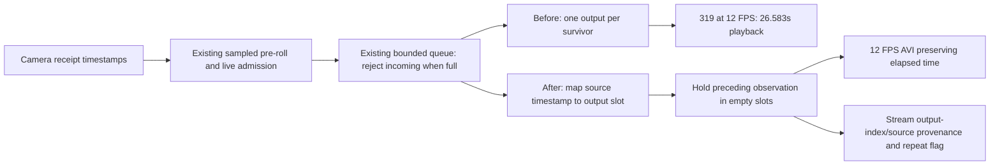

1. **What caused Phase 4 time compression?** Empty source-time sample slots and nine rejected eligible packets were omitted from a fixed-12-FPS AVI. The writer emitted one frame per survivor, compressing 31.864416 seconds into a 26.500-second endpoint span. Of 64 missing grid slots, nine correspond to queue drops and 55 to upstream/sampling shortfall. Exact upstream attribution is unavailable for that historical run.
2. **Was camera delivery primary?** It contributed empty observation slots, but cannot alone explain the playback error. The new full trace proves irregular delivery plus sampled pre-roll; the conversion of omissions into shortened playback was the recorder defect.
3. **Was encoder throughput primary?** Sustained sub-12-FPS encoding was not demonstrated. The new run measured 17.10 FPS of capacity from encoder busy time and steady 12 FPS presentation output after catch-up. Transient startup contention did cause queue pressure.
4. **Was queue/backpressure primary?** It accounts for 0.750 seconds of the old 5.364-second compression, not the remaining 4.614 seconds. All nine old drops occurred within the first five-second sample interval. The new run records 21 exact startup drop identities.
5. **Was fixed-FPS representation primary?** Yes: one-surviving-observation/one-output-frame silently removes elapsed time whenever sample slots are absent. AVI can preserve time when missing slots are deliberately represented.
6. **Minimal fix?** Keep the existing sampler, queue and MJPG writer; map source times to 12 FPS output slots, hold the preceding immutable observation through empty slots and the session tail, and stream explicit per-output provenance. No new observation or camera pixel is invented.
7. **Camera mode/config changed?** No. 1280×720 MJPG, requested 15 FPS, reported 60 FPS; detector/config/model files unchanged. Only 60 FPS MJPG and 9 FPS YUYV are advertised at 720p. No driver/control adjustment was made.
8. **Memory bounds changed?** No configured increase: eight live slots, 128 MiB aggregate private pixel budget, same pre-roll/session limits. One last-written reference is retained and charged inside that budget; no duplicate image is queued/copied. Measured private peak 52.734 MiB.
9. **Detector behavior changed?** No detector source/config change. Recording cadence was 1.9994 Hz; no stale/backlog failure during active measurement.
10. **Tests?** **721 passed**, zero failures/errors/skips, final full suite. Nine new timing regressions; two existing frame-count expectations now assert exact deliberate repeats while preserving unique observation/order/pixel checks.
11. **Final Pi RECORD 30?** One backend-owned 30.000-second request, native clean MJPG, 384 written/decoded presentations, 294 unique observations and 90 declared repeats; approximately 1.921 seconds of pre-roll.
12. **Complete or degraded?** **DEGRADED**, honestly retained: 21 startup queue drops and a maximum 1.107-second gap between encoded unique observations. Time preservation passes; observation fidelity is not relabeled complete.
13. **Source span?** 31.846610 seconds between first/last retained source observations. The first observation through requested deadline spans 31.920917 seconds.
14. **Encoded/playback span?** Endpoint span 31.916667 seconds; container/playback duration 32.000 seconds. Endpoint mismatch vs source span is +0.070057 seconds, not multi-second compression.
15. **Unique source frames?** 294 encoded; 315 eligible before 21 rejected admissions. These are frames, not independent visits or training examples.
16. **Represented output frames?** 384, of which 90 hold prior pixels. Every output index has original generation/sequence/monotonic/wall provenance and a repeated flag.
17. **Queue drops?** 21, all between +0.936 and +5.726 seconds after RECORD. Twenty in the first five seconds, one in the next five, zero thereafter. No queued frame was replaced.
18. **Detector latency?** Inference median 148.0 ms baseline →151.2 ms recording; age median 176.2→176.8 ms. Recording inference p95/p99 157.6/164.4 ms; age p95/p99 197.4/207.6 ms.
19. **Thermals?** Recording samples 61.84–65.73°C; all-phase peak 67.68°C. Current throttle bits stayed zero; historical 0xe0000 unchanged. Guard 78°C or any current low-four-bit flag. No thermal-equilibrium claim.
20. **Ready for Phase 5?** **HOLD Phase 5.** The elapsed-time defect is fixed and validated, but the clip remains degraded from precisely localized startup observation loss. This closes the time-representation repair, not full collector/fidelity acceptance or any physical/control integration.

# Phase 4.5 handoff — 2026-09-07 / 08 UTC

Evidence root: `D:\Squirrel_Squirter_ML_Rebuild\08_evaluation\pi_benchmarks\phase4_5_recording_20260907`. Original Phase 4 evidence was read only and is preserved. Worktree: `C:\dev\squirrel-squirter-runtime-v2`, branch `squirrel-runtime-v2`; baseline `d8e28fea0093bf1e5f01c58b37961761e864cb1f`. The original dirty `manual-control` worktree and owner-only `Misc/` were not edited/staged.

## Exact code, deployment and measurement identity

Implementation commit: `cd05b6051d1d5d775e72709fe8f828f712d95e35` (published). Only `src/squirrel_shooter/recording.py`, `tests/test_recording.py` and new `tests/test_recording_timing.py` changed in that commit. This handoff is a separate documentation commit.

Final stopped Pi recorder SHA-256: `50b6fd1c09f6dd9c6bf0efec1f80c4245f970dcbcbff428a7ea62771933aede5`.

The single live recheck used recorder SHA-256 `d38280580d8bec41a2293e5b9cfead60a4bb8ed51dff27de7e8b5d57a0b5ee8c`, stored in `source_receipt.json` and the fetched run receipt. During that run, review found the new missing-head check would incorrectly mark later rotated segments degraded. The final version restricts that check to segment zero and adds the two-segment regression. The one-segment live recording exercised the same behavior before/after this one-line condition correction. Final source was validated with all 721 offline tests and installed/hash-verified **while stopped**; no second 30-second run is claimed. `source_receipt.final.json` makes this distinction explicit rather than assigning the live measurements to byte-identical final source.

Pi directory remains `/home/bslizzle8552/squirrel_collector_phase4_20260907`. New measurements/media are solely in its `measurements_phase4_5/`; original measurement folders and clips were not overwritten. The measurement harness directs its recorder to that new output directory without changing collector.yaml. The final current source receipt is updated; the prior receipt and recorder are backed up separately. All 65 deployed source hashes, model/config hashes and four protected legacy files were verified before and after. `DELIVERY_VERIFICATION.stdout` confirms final source, camera unowned, collector absent and legacy service inactive/dead/MainPID=0. No autostart/service was created.

The same sealed v3 epoch149 FP32 model, 416 input, two NCNN threads, OpenCV one thread, diagnostic floor 0.01 and 2 Hz worker were used. Manifest SHA-256 `85d2f64c89f3e6c0499f594390b05fe509ec9934ea1c40d19ab4a6122db46501`; config SHA-256 `dd24d06e7c2a6a7dc83bce83d99260c0d51c802265241503f96af3518aacd16a`. Full model/bin/param/equivalence and protected config/calibration/rate-ledger/service hashes are in preflight/final receipts. No legacy perception, control service, physical import or GPIO/I2C descriptor appeared in the runtime audits. No training, export, Golden, threshold, firing/calibration/servo/valve change or Phase 5 implementation occurred.

## Phase 4 forensic reconstruction: what is and is not recoverable

Historical session `ad83d276a9bb4d5aa0a38c85e7da97d3`; video SHA-256 `1bba49c07c4501c0d5c2d6e04d6d85aa71d155e29401687b86d9734f895eb9cc`.

| Historical quantity | Evidence-backed value |
|---|---|
| Request | monotonic 25576.981561652 through 25606.981561652 |
| First / last encoded source | seq 1320 at 25575.061031587 / seq 1943 at 25606.925447360 |
| Camera publications between those endpoints | 624 =1943−1320+1; sequence is incremented per publication |
| Exact available source count within manual boundaries | **Not retained**; 624 includes pre-roll and is not a 30-second count |
| Eligible under actual recorder sampling | 328 total, including 18 pre-roll; 310 live |
| Successful admissions / encoder packets / written / decoded | 319 each |
| Before-insertion rejection | 9 aggregate queue/byte admission drops; historical trace does not identify their exact cause/sequence individually |
| While-queued replacement/drop | 0; implemented policy never evicts queued frames |
| Source samples bypassed | sidecar skipped_source_sequences=296; includes deliberate sampling, not 296 camera failures |
| Grid through final source slot | floor(31.864415773×12)+1 =383 slots |
| Missing grid slots | 383−319=64; nine queue-equivalent slots +55 upstream/sampling slots |
| Even without queue loss | (328−1)/12=27.250s endpoint, still 4.614416s short |
| With actual queue loss | (319−1)/12=26.500s endpoint, 5.364416s short |

`PHASE4_FORENSICS.json` and `phase4_written_timeline.csv` contain the cumulative missing-slot curve, written gaps, sequence identities and two-second bins. Source and encoded ordering are strictly increasing. The first five-second sample already records all nine drops; the count stays nine through finalization, so these losses are clustered at startup, not sustained uniformly. Empty presentation slots continue outside that cluster. The largest written-observation gap was about 0.986s.

The old measurement harness logged timestamps only at `_write_packet`. It did **not** retain all camera arrivals, rejected candidates, successful-admission times, write start/end or queue residence. Its `source_frames` name means sampling-eligible-before-drop. Consequently questions about exact historical rejected IDs, raw gap locations, encode speed and each camera-versus-sampler loss cannot be answered uniquely. No aggregate FPS number or new run can retroactively supply those missing records. The 55 upstream slots may involve camera gaps, shared-ring sampling and/or latest-only collection. The new trace below directly distinguishes those paths for the recheck.

### Root-cause timeline

1. Camera receipt timestamps establish elapsed observation time independently of driver-reported FPS.
2. The shared pre-roll ring is already sampled; the recorder samples its returned packets again. Live collection borrows the latest packet and advances to the next time slot, discarding empty slots rather than catching up.
3. Before the fix, each admitted survivor produced exactly one fixed-duration AVI presentation. Skipped slots had no playback representation.
4. Pre-roll is correctly ordered before live packets. Its initial encode work competes with newly arriving live packets; a full queue rejects incoming eligible packets. This explains an additional localized observation gap, not the whole timeline discrepancy.
5. Fixed-FPS one-per-survivor serialization converts both upstream omissions and queue rejections into shortened playback.
6. After the fix, empty output slots hold prior real pixels and are explicitly marked as repeats; no gap is promoted into an independent source observation.

## Before/after frame flow

The detector separately borrows the same raw camera stream through its unchanged latest-frame worker. It never sees presentation repeats.

## Deterministic reproduction and regression evidence

Before source edits, all five new timing tests failed against d8e28fe (`before_fix.txt`). With no queue pressure, synthetic 20 Hz bursts produced only 240 presentations for 30 seconds: 20 seconds of playback. Irregular cadence, source gaps, slow consumer/queue pressure and pre-roll reproduced variants of the same defect. Inputs have explicit sequence numbers and monotonic timestamps; pixels are labeled synthetic stand-ins.

After correction, those same inputs preserve the requested timeline, with monotonically ordered unique source identities, explicit holds, exact repeated pixel equality and bounded queue/bytes. Additional tests cover unchanged drop-incoming behavior, long missing tail remaining degraded, delayed first source never invented and normal segment rotation not misclassified. Existing deadline, pre-roll race, raw immutability, real encode/decode, hung writer, disk errors, clean API, detector cadence and prohibited physical-construction tests still pass.

Retained actual Phase 4 encoder timestamps were also replayed with synthetic 32×24 stand-in pixels: original 319 unique observations →384 presentations, 65 repeats, 32.000-second playback; source span remains 31.864416s. This is a timeline test, not newly recorded native camera evidence. Its near-one-second unique-source gap stays degraded. See `RETAINED_REPLAY.json` and `retained_trace_replay/`.

Validation sequence: initial focused development run 48 passed/4 failed (new fixture thresholds and old one-output-per-source expectations); corrected focused collector/recorder/worker/API run 78 passed; initial full suite 720 passed; added rotation regression and one-line condition fix; final full suite **721 passed in 61.91s**, zero failure/error/skip. New timing tests alone: nine passed. Exact repeat lists replace old fixed counts; no safety, deadline, byte cap or source ordering assertion was weakened. `full_final.xml`, `full_final.txt` are authoritative. Early standalone replay also hit a missing output directory; only its evidence script was corrected. Development failures remain retained.

## New Pi frame-flow accounting and camera evidence

The bounded harness records every camera publication at the existing publish timing hook, all recorder `_admit` calls, encoder packet entry/exit and each native writer call. Camera sequence coverage is contiguous for the entire run. Logging is measurement-only; no new camera, service, inference consumer or queue was added. Timers include instrumentation overhead. Queue residence begins immediately before admission, so it includes the small private-copy/admission time.

| New flow quantity | Count |
|---|---:|
| Camera arrivals in exact manual 30s window | 490 |
| Camera arrivals first pre-roll source through deadline | 525 |
| Recorder offered packets | 510 =490 live +20 from sampled pre-roll ring |
| Sampling eligible | 315 =299 live +16 pre-roll |
| Successfully admitted / reached encoder / unique written | 294 |
| Dropped before queue insertion | 21 (queue_full; zero byte-budget drops) |
| Dropped/replaced while queued | 0 |
| Native encoder calls / decoded presentations | 384 |
| Declared repeats | 90 |

All 294 admitted sequence IDs match encoder unique packet IDs exactly. All 384 output indices are present; unique identities increase, repeated identities equal the preceding observation, and decoded repeated pixels are identical to the preceding frame. Each of the 90 repeats is accounted for by comparing occupied source-time slot sets:

| Slot accounting through requested endpoint | Slots |
|---|---:|
| Required presentation slots | 384 |
| Slots occupied by a raw camera arrival | 322 |
| No camera arrival in slot | 62 |
| Raw occupied slots not offered by sampled pre-roll | 7 |
| Offered occupied slots lost to recorder sampling | 0 |
| Eligible slots lost to full queue | 21 |
| Unique retained slots | 294 |

62+7+21=90; no unexplained missing presentation time. The 62 empty slots include endpoint quantization/window coverage and ordinary inter-arrival gaps; they do not mean 62 driver capture failures. All 490 live camera publications were offered to the recorder; the seven extra occupied-slot losses are confined to pre-roll. The 195 offered packets rejected by sampling share slots or occur before the next boundary; they do not create further empty occupied slots in this run.

Manual-window source delivery was 16.33 count-derived FPS, with intervals median 51.2 ms, p95 176.8 ms, p99 189.7 ms, maximum 197.1 ms. Sixty inter-arrival gaps exceeded the 83.33 ms output period. Bursts and gaps coexist despite an average above 12 FPS. No source generation/reconnect change occurred. The existing smoothed inverse-interval FPS display and reported driver 60 FPS are not count-derived throughput.

Read-only V4L2 enumeration confirms 720p MJPG advertises only 60 FPS; YUYV advertises 9 FPS. There is no supported nearby 10/20/30 FPS MJPG rate to select on this device. Current controls expose automatic exposure and dynamic framerate enabled; that is a possible contributor, not proof of a sensor/lighting root cause. Exposure/driver controls were not modified, resolution remains 1280×720, and no speculative supported-rate claim is made. A later daylight/exposure comparison would require separate scope. This pass does not prove a camera replacement or ventilation change is necessary.

## Encoder throughput and startup backpressure

Local Windows bounded file-only benchmark: 120 MJPG encodes at native 1280×720 using a retained clean garden frame, OpenCV one thread; median 8.01 ms, p95 10.13 ms, measured busy capacity 120.82 FPS. This is not Pi evidence. `LOCAL_ENCODER.json` preserves it separately.

Pi, actual detector coexistence: 384 native calls; mean 58.49 ms, median 51.01 ms, p95 149.69 ms, p99 187.02 ms, maximum 207.76 ms. Busy-time capacity 17.10 FPS; total writer-window output rate 12.80 FPS includes pre-roll catch-up. Twenty-two calls exceeded an 83.33 ms slot. Thus average capacity exceeds 12 FPS, with significant transient jitter.

The encoder must serialize roughly two seconds of pre-roll while live input continues. It has an average margin of about 5.10 presentations/s over the ongoing 12 FPS stream, but the queue only holds eight eligible live packets. Initial long encode calls and the mandatory pre-roll catch-up fill that queue; later holds represent the rejected observations' elapsed intervals. Direct data: 20 drops during seconds 0–5, one at 5.726s, none during 10–30. The writer produced 71/72/60/60/60/60 presentations in successive five-second live bins. This is startup backpressure that clears, not a persistent inability to encode the requested steady rate.

Queue residence p50/p95/max was 24.8/1388.8/1793.3 ms overall. After ten seconds it was 12.3/62.3/94.3 ms. Queue depth never exceeded eight. Private bytes peaked at 55,296,000 (52.734 MiB), below 128 MiB; final buffered bytes zero. Source/written counts, admission drop identities and timing are in `RECHECK_ANALYSIS.json` and raw JSONL. Exact first/last drops are +0.935738/+5.725930 seconds. The 1.107s retained-observation gap is a queue-loss gap; the largest actual camera interval was only 0.197s.

The new run retained fewer unique observations than Phase 4 (294 versus 319) and had more startup drops (21 versus nine). Filling presentation slots adds encode work; camera delivery/scene conditions also differed, so this is not a controlled estimate of each contribution. The gain is honest elapsed-time playback, not improved observation coverage. That tradeoff remains explicit in degraded status.

## Strategy decision

| Option | Decision and reason |
|---|---|
| Timestamp-aware CFR holds | Implemented: localized timing preserved, same codec/service/queue, native pixels, exact repeat provenance. |
| Replace arrival counting with elapsed sample slots | Already mostly present in admission; vacant slots were never serialized. Rewriting admission alone cannot recover periods with no source observation. |
| Hold preceding frame | Implemented; no interpolated/generated pixels and no extra image queue. |
| Lower recording rate | Not selected: steady 12 FPS was directly sustained. 10 FPS would lower encode demand 16.7% and nominal pre-roll presentations from24 to20, but would reduce temporal resolution to100ms and still require honest gap representation. No unsupported claim that it fixes all startup loss. |
| Replace oldest queued observation | Not selected: exchanges which source identity is lost, without solving elapsed time; existing chronological drop-incoming policy stays. |
| Larger queue/another queue/service | Not selected. No memory increase or architecture redesign. |
| Change supported camera rate | No nearby 720p MJPG alternative advertised; no setting change. |
| Set AVI FPS to average unique count | Rejected: may align total duration while redistributing localized gaps over the entire recording. |

## Pi recheck table

One run: short settle →60s detector baseline →one manual RECORD30 plus finalization →30s recovery →stop. The recording row includes five seconds for finalization. 100% process CPU is one core; process CPU derives from Linux ticks over each phase's sample interval, RSS from /proc, temperature/throttle roughly every five seconds.

| Phase | Seconds | Detector Hz | Inference p50/p95/p99 ms | Age p50/p95/p99 ms | Process CPU % | Peak RSS MiB | Temperature °C | Count source FPS |
|---|---:|---:|---|---|---:|---:|---|---:|
| settle | 10.2 | 2.000 | 147.6/165.4/166.4 | 172.7/178.8/184.4 | 89.7 | 177.0 | 56.48–57.94 | 11.13 |
| detector_only | 60.1 | 2.000 | 148.0/171.8/181.8 | 176.2/206.3/222.6 | 80.0 | 187.8 | 57.94–62.32 | 17.08 |
| recording | 35.0 | 1.999 | 151.2/157.6/164.4 | 176.8/197.4/207.6 | 148.3 | 308.1 | 61.84–65.73 | 16.36 |
| after_recording | 30.1 | 1.999 | 147.7/174.7/183.1 | 185.1/209.4/220.8 | 80.2 | 313.9 | 64.27–67.68 | 16.71 |

Zero stale-before, stale-after, duplicate/regressed or source-change errors during active measurement. At shutdown one in-flight completion was explicitly rejected with `dropped_reason=shutdown`, so the final error_unavailable counter is **1**, not zero; total inference count268, shutdown_timed_out=false. Active measurement observations total267. All object/module/device audits passed and OpenCV threads=1. No positive boxes were retained above the unchanged diagnostic floor; that is not proof of absence of wildlife.

## Final clip, sidecar and visual verification

- Session: `b5bf6ff21e87406e936cec8f20bc408b`.
- File: `pi_recheck/measurements_phase4_5/recordings/b5bf6ff21e87406e936cec8f20bc408b/segment-0000.avi`.
- AVI SHA-256: `47ed62cddad00336c9ae522bb74e6bf822a9ede41a464be09d465da6d2f55f65`.
- Provenance: `segment-0000.presentation.jsonl`, SHA-256 `b5517007b53a276b897bd004b19ef3be83e29fdd9366f84560bd3dec151f75ef`.
- Native geometry1280×720, MJPG/12 FPS, 384 complete decoded frames; no failed/truncated geometry/count/hash check.
- Source first/last sequence: 1131 / 1654; receipt times 27084.921675757 / 27116.768285569.
- Request start/end: 27086.842592883 / 27116.842592883. Final source precedes deadline by74.307ms, covered by declared hold/quantization.
- Full per-output provenance and repeated-pixel equality checked independently after download. All downloaded artifact hashes match the Pi receipt.

Native first/middle/last decoded frames (0/192/383) were visually inspected: dark monochrome garden, no burned boxes, text, timestamps, crosshairs or FIRE marker. The scene is poorly illuminated; no biological training/visit label is assigned. Visual inspection was sampled, while full-file decoding, dimensions, counts, identity and repeat checks cover all frames. No overlay draw/resize/crop was introduced. `media_review/` retains the native review PNGs; `MEDIA_VERIFICATION.json` retains full checks.

## Recording contract and known limits

Output slot index is floor((source receipt−segment origin)×FPS), with numerical boundary tolerance. Unique observation presentation can precede its receipt by less than one output period (83.33ms at12 FPS); no per-sample subframe timestamp precision is promised. Empty slots hold the preceding real observation. Finalization fills presentation duration through the deadline, rounded up to one frame. Receipt means after OpenCV read, not sensor exposure.

Schema2 sidecars keep true first/last source timestamps and counts, distinct unique/repeated presentation totals, playback duration and source gap maximum. A streamed, hashed JSONL file maps every output frame to its original sequence/generation/source monotonic/wall time. **Repeats are presentation only and must never be counted as independent detector/training observations.** There is no video-to-training promotion in this pass; external consumers must retain/use this provenance. Atomic session metadata, bounded128-event timeline plus omitted count, storage quota and interrupted recovery remain. Per-output JSONL is disk streamed (bounded by session duration/FPS), not retained in RAM; only finalization fsyncs/hash-seals it. Crash recovery keeps incomplete evidence without validating it as complete.

Queue rejection still marks the session degraded. Unique-observation gaps >max(0.5s,2/FPS), delayed first source and missing tail remain degraded even when held playback has correct duration. No leading camera pixels are invented if the first source arrives late. Across a long outage, tail holds are capped at the existing segment-duration bound; longer uncovered time stays explicit/degraded in source/session endpoints rather than generating an unlimited fill. Existing shutdown join remains bounded; Python cannot cancel a blocked native encode call. A long stalled writer/source loss is not certified complete by the added holds.

The retained prior observation adds one live reference, charged within the unchanged aggregate pixel budget; it does not add another full-frame copy. The existing max-pre-roll/queue/one-inflight structure now includes this last-written reference; byte cap remains authoritative. JSONL disk growth is covered by the existing soft storage quota/check interval, not a hard disk reservation.

This short run demonstrates steady12 FPS capacity and the time contract on this scene. It does not establish all-lighting encoding capacity, thermal equilibrium, model accuracy, physical aiming, water/servo/valve behavior or unattended safety. Exact historical upstream attribution is permanently limited by the old telemetry. A ventilation/camera hardware fault is **not proven**. The remaining software startup loss is precisely characterized; no new queue/config experiment or second manual30 was run outside tonight's bound.

## Rollback and final recommendation

Leave the Pi collector **stopped** (verified). Legacy service also stays stopped. Starting either runtime later requires its own operational decision and camera-ownership/thermal checks; never run both camera owners together.

To restore the previous isolated recorder without touching legacy runtime or evidence: while stopped and camera unowned, verify `recording.phase4_backup.py` matches d8e28fe's recorder hash from `source_receipt.phase4_backup.json`, restore that file to `source/src/squirrel_shooter/recording.py` and restore the backed-up source receipt. Reverify all65 hashes. This returns to the known time-compressing implementation; keep Phase4.5 clips and JSONL sidecars. Source rollback on the published branch should use a reviewed revert of `cd05b6051d1d5d775e72709fe8f828f712d95e35`, never reset/clean the dirty original worktree. No rollback step starts legacy/control services or deletes evidence.

**Stop here under outcome A for the elapsed-time repair: fixed and validated. Overall recording fidelity acceptance remains partial/degraded, with quantified startup queue loss. HOLD Phase5.** The next separately scoped decision is whether to accept explicitly declared startup holds for evidence gathering or measure a small startup-admission/pre-roll improvement. Current evidence does not justify reducing detector cadence, restoring legacy perception, increasing queues, changing camera controls/resolution, replacing hardware or changing firing policy. No such next-phase work was performed.

## Evidence index

`PHASE4_FORENSICS.json`, `phase4_written_timeline.csv`, `before_fix.txt`, `RETAINED_REPLAY.json`, `LOCAL_ENCODER.json`, `focused.xml`, `full.xml`, `rotation_check.txt`, `full_final.xml`, `preflight.stdout`, `source_receipt.json`, `source_receipt.final.json`, `pi_recheck.tar.gz`, `pi_recheck/measurements_phase4_5/*.jsonl`, `RECHECK_ANALYSIS.json`, `MEDIA_VERIFICATION.json`, `resource_trace.csv`, `DELIVERY_VERIFICATION.stdout`, native review PNGs, and the reproducible Python evidence scripts are retained under the new evidence root. `ARTIFACT_SHA256SUMS.txt` is the final local artifact inventory. This handoff is duplicated in repository docs for durability.
