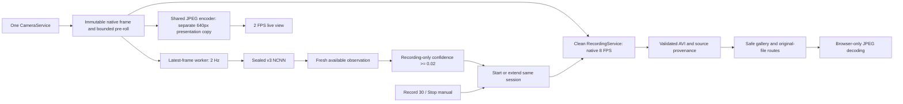

1. **Can the owner see the live camera?** Yes. The running Pi dashboard was opened from the normal Windows computer over Tailscale. Desktop and mobile-width layouts were visually verified; a physical phone was not separately tested.
2. **Preview FPS/quality?** Maximum 2 FPS, JPEG quality 65, width capped at 640 pixels (640×360 here). Saved footage remains native 1280×720.
3. **Effect on 2 Hz inference?** No material cadence effect in the bounded check: 1.999 Hz with and without preview. Final inference median 151.1 →150.9 ms.
4. **Does a qualifying squirrel result start recording?** Yes. The real inference-worker completion path is connected to recording. Two explicitly injected adapter positives on the Pi started and extended a session. No natural squirrel positive was observed during the bounded tests.
5. **Recording-only threshold and why?** Configurable 0.02. Retained hard-squirrel confidence is 0.0268474445; the two Phase 4 background-like observations were 0.01643746 and 0.01703519. This is a recall-oriented collection candidate, not statistically optimal or a firing threshold. Some negatives will record.
6. **Automatic tail?** Ten seconds after the latest qualifying source receipt timestamp, with up to two seconds of pre-roll.
7. **Repeated detections?** Extend the same logical session. A detection does not assert a biological visit. Existing 600-second session and 60-second segment caps remain.
8. **Manual Record 30?** Yes. The Pi completed a full backend-owned 30-second request. The normal browser separately exercised Record 30 and early STOP.
9. **Does STOP preserve automatic reasons?** Yes. Pi HTTP and offline tests prove manual/automatic coexistence and manual-only cancellation.
10. **Recent clips visible?** Yes: up to 20 sessions with local timestamp, reason, duration, maximum qualifying confidence and status.
11. **Play/open/download?** Yes. Browser-side MJPG AVI playback worked on the actual Pi file; downloads return original AVI bytes, and range requests are supported. No Pi transcoding.
12. **Saved media still clean?** Yes: native clean writer, immutable source, no overlays/crop/resize in authoritative video. Final test clips were fully decoded and hash/provenance checked; native first/middle/last frames were visually inspected.
13. **Degraded clips marked?** Yes, in the gallery and player. Final controlled automatic/manual clips remain DEGRADED, with four/two queue drops respectively.
14. **Legacy perception/control running?** No. Legacy service inactive/MainPID=0; one collector owns the camera. Audits found no prohibited objects, physical modules or GPIO/I2C descriptors. No MobileNet, MOG2 or legacy tracker worker is constructed.
15. **Preview cost?** Final A→B: +2.34 percentage points of one CPU core, peak RSS +9.51 MiB, preview-only encode average 8.92 ms. Temperature ranges were 66.71–69.14°C then 68.17–70.11°C; sequential warming prevents attributing that difference entirely to preview. Current throttle bits stayed zero; whole final test peak 75.96°C.
16. **Owner URL?** **http://100.110.85.40:5094/**. Computer/phone must use the existing private Tailnet. The collector binds to that address only.
17. **Usable for unattended data gathering today?** **Yes, with declared limits.** The normal collector is running independently of SSH. Live view, automatic clean recording, manual controls and recent playback work. Saved video now uses **8 FPS**, based on direct daytime loss measurements. Startup degradation, finite storage, reboot behavior and unproven long-term thermals remain explicit below. There is no firing or movement capability.

# Phase 4.6 handoff — 2026-09-08

Worktree: `C:\dev\squirrel-squirter-runtime-v2`; branch `squirrel-runtime-v2`; starting HEAD `82b373c`. All requested Phase 2/3/4/4.5 handoffs were read; newer timing contracts supersede older planning. The original dirty `manual-control` worktree and owner-only `Misc/` were preserved. No merge to main or legacy branch change occurred.

Evidence root: `D:\Squirrel_Squirter_ML_Rebuild\08_evaluation\pi_benchmarks\phase4_6_collector_20260908`. Private garden screenshots and large clips remain outside Git. This handoff is duplicated there.

## Architecture



The worker invokes a short in-memory observer under its source-revision lock. Unavailable, stale, future or superseded-generation results cannot extend recording. Observer errors are surfaced without killing inference. The recorder also validates source age and ordering. A stable observer identity is used and visit_id stays null. Deadlines use source receipt time, never callback arrival time.

The shared JPEG encoder sleeps without viewers and skips frames for slow consumers. No second camera, capture backlog or legacy runtime builder was added. The optional preview-width argument defaults to zero for existing non-collector callers. Only the collector presentation copy is resized; clean native frames are unchanged.

## Final Pi configuration

The isolated directory remains `/home/bslizzle8552/squirrel_collector_phase4_20260907`. Its `collector.yaml` uses:

```yaml
collector_preview:
  enabled: true
  maximum_fps: 2.0
  jpeg_quality: 65
  maximum_width: 640
automatic_recording:
  enabled: true
  squirrel_confidence: 0.02 # RECORDING ONLY
  tail_seconds: 10.0
recording:
  enabled: true
  target_fps: 8.0
  pre_roll_seconds: 2.0
  manual_duration_seconds: 30.0
  maximum_segment_seconds: 60.0
  maximum_session_seconds: 600.0
  storage_budget_megabytes: 8192.0
```

Other recorder limits remain: eight live queue slots, 128 MiB aggregate private pixel budget, 256 MiB free-space floor, no automatic deletion. The collector applies its separate ten-second tail; the generic recorder's three-second default and repository's 12 FPS default remain for compatibility. Repository automatic recording defaults disabled; this isolated Pi config explicitly enables it.

Detector remains 2 Hz, NCNN two threads, OpenCV one thread, diagnostic floor 0.01. Camera request remains 1280×720 MJPG/15 FPS; its known driver-reported 60 FPS mismatch was not changed. Model files, dependencies and calibration were not changed.

Unattended recordings go to `phase4_6_data/recordings/` beneath that Pi directory. Controlled tests are separated under `measurements_phase4_6*/controlled_test_media/recordings/`. Injected observations carry model ID `INJECTED_TEST_NOT_MODEL_OUTPUT`; they are not natural squirrel evidence or approved training labels.

The 8 GiB quota is not a guarantee of two weeks of storage. Final benchmark files consumed about 74 MiB for roughly 44 seconds of combined presentation: an order-of-magnitude allowance near 80 minutes of recorded footage at that scene-dependent rate. Frequent false positives can fill it earlier. Recording then reports a storage error and stops admission; nothing is automatically deleted. About 44 GiB was free before testing. Export/retention decisions remain with the owner.

## Recording-only confidence evidence

Only retained result JSON was inspected; no locked pixels were re-inferred and no Golden, training or export run occurred. `threshold_evidence.json` binds the original `V3_RAW_DETECTIONS.json` by SHA-256.

| Retained case | Confidence |
|---|---:|
| Strong squirrel | 0.6146268249 |
| Hard squirrel | 0.0268474445 |
| Person/background candidate | 0.0453357510 |
| Rabbit | 0.0576131307 |
| Deer candidates | 0.0207433552 / 0.0141209587 / 0.0103445416 |
| Two Phase 4 background-like observations | 0.01703519 / 0.01643746 |

0.02 preserves the hard-squirrel candidate and excludes those two specific Phase 4 observations. It also accepts the listed rabbit, stronger person/background candidate and one deer candidate. Those extra recordings are acceptable here. This small set establishes neither an optimal threshold nor future accuracy. No engagement threshold was selected or changed.

## Metadata and media authority

Each qualifying observation retains model/version/artifact identity, strongest qualifying confidence and native box, source generation/sequence, monotonic/wall time, capture-to-result age and recording-only threshold. One observation contributes once even with multiple candidate boxes; its strongest qualifying box represents it. First/last observations, total count, maximum confidence, extension count and manual participation survive timeline truncation.

At most 2,048 observation entries are retained, with omitted count and persistent first/last/max summaries. At 2 Hz and a 600-second session this covers the normal full session. The existing 128-entry timeline remains bounded. Checkpoints use the existing encoder path; the callback does not write files or fsync. Main dashboard status omits the growing observation list; full recorder diagnostics and session.json retain it.

Segments retain start/end, pre-roll, native geometry, source timing, unique/repeated counts, validation digest and streamed per-output provenance. Only validated clean-authoritative segments get playback/download links. Error/interrupted/unreadable sessions remain visible; incomplete/unvalidated bytes do not gain clean links. Degraded valid clips remain accessible and visibly marked.

**Lossy repeat qualification:** Initial verification assumed decoded holds must be byte-identical, following the earlier night-run result. Four early holds across the final two clips disproved that assumption. An eight-frame file-only Pi probe wrote exactly the same immutable input eight times, verified identical input hashes, and reproduced startup decoded differences using FFMPEG MJPG, followed by exact repeats. Final verification therefore records decoded differences and verifies source identity instead of claiming universal decoded pixel equality. No source mutation or overlay was found. Sixty-six of seventy final holds decode identically to their predecessors; all seventy retain the proper source identity. See `codec_probe.stdout` and `final_run/MEDIA_VERIFICATION.json`. No codec or clean-writer redesign was introduced.

## Bounded performance and operating correction

Final source/config: 640px preview plus native 8 FPS recording. CPU 100% means one core of four. Percentiles are p50/p95/p99; age means receipt-after-read, not exposure time. RSS includes measurement overhead.

| Workload | Seconds | Detector Hz | Inference ms | Age ms | CPU % | Peak RSS MiB | Temperature °C |
|---|---:|---:|---|---|---:|---:|---|
| A: detector only | 20.0 | 1.999 | 151.1/155.5/168.5 | 175.7/190.2/195.9 | 96.4 | 163.0 | 66.71–69.14 |
| B: detector + preview | 20.0 | 1.999 | 150.9/163.1/173.6 | 174.4/193.9/203.8 | 98.8 | 172.5 | 68.17–70.11 |
| C: preview + auto/manual overlap | 14.0 | 1.999 | 155.0/164.6/166.3 | 179.3/192.0/197.1 | 163.7 | 274.6 | 70.60–73.04 |
| C: preview + manual 30 | 35.0 | 1.999 | 154.3/165.1/169.5 | 174.5/196.8/198.4 | 163.4 | 281.5 | 72.55–75.47 |

Preview measured 1.999 Hz in B and about 1.92–1.97 Hz during recording. Mean preview encode cost was 8.92 ms in B, cumulative mean about 7.5 ms during recording. A→B RSS includes startup/allocation growth, so +9.51 MiB is not a precise isolated attribution. Current low-four-bit throttle flags stayed zero; historical 0xe0000 remained. Whole final test peak including finalization was 75.958°C. No long-term thermal equilibrium claim is made.

The initial native-width preview run held detector cadence but produced 73 automatic-test and 246 manual-test drops. Its harness marked success before the last clip finished finalization; recorder shutdown timed out and the interpreter aborted. **Its retained `passed: true` is overridden by that failure, not acceptance.** Original media/logs remain under `initial_run/` and `phase4_6_results.tar`.

A 640px preview correction reduced JPEG cost. The corrected harness drains finalization between independent test sessions and before shutdown. At 12 saved FPS, the daylight manual clip still retained only 124 unique observations, 259 holds and 174 queue drops, with a maximum 1.274-second source gap. Sequential scene/lighting differences prevent a pure causal attribution, but 12 FPS was clearly a poor operational setting in this workload.

A config-only **8 FPS** check on the same corrected source retained 207 unique manual observations and two drops. Automatic overlap retained 78 unique observations and four drops. Native pixels, time representation, queue/memory bounds, detector cadence and controls stayed unchanged. This is a bounded operating choice, not an optimal frame-rate claim or recorder redesign. Startup-loss optimization remains deferred.

| Session | Reason | Playback | Unique / holds | Drops | Status |
|---|---|---:|---:|---:|---|
| `a6caaa409399459696e000e9dc1c4724` | injected squirrel + manual overlap | 12.375s | 78 / 21 | 4 | degraded |
| `4dcc09731f384fa4a97861f61ff096d7` | manual 30 | 32.000s including pre-roll | 207 / 49 | 2 | degraded |

Both fully decode at 1280×720 with 99/256 outputs, matching sidecars and provenance. Unique source identities increase; holds reuse prior identity. First/middle/last native frames show the garden without boxes, text, timestamps, crosshairs or FIRE marker. No confirmed squirrel is assigned. Final harness shutdown had zero pending sessions, no timeout, no camera owner and only its main thread remaining.

Automatic AVI SHA-256: `75af2813f9562a3a3b6fc77b2712c066173cbd0473dd498acd0a07a1640f5dd3`.

Manual AVI SHA-256: `5daa14ecaf72f8944c05025aa038c8dfed3e0e76cb3db8f3a82c8891105becda`.

## Actual owner browser workflow

The normal service, without injection or a measurement wrapper, was started as PID 6555. Windows browser validation over the real Tailnet URL exercised preview, detector updates, Record 30, enabled STOP, early stop, gallery appearance and browser-side playback.

Browser session `9f3c88dae8b348d68ed752a101d30739` produced 28.125 seconds including pre-roll: 218 unique observations, seven holds and four drops, visibly DEGRADED. It ended with `manual_stop`; its original manual deadline was request time +30 seconds. Playback visibly advanced from 12.3 to 17.0 seconds. Original download SHA-256 `8c0d2938e4f6a19389883784205c9cf0d7d5f2f5fd04cfa85ded852cad8945f8` matches the Pi sidecar. Browser error output was empty.

Visually reviewed screenshots in the evidence root: `dashboard-desktop.png`, `dashboard-mobile.png`, `playback-mobile.png`. Mobile means a 390×844 viewport on the normal computer, not separate phone hardware.

The player loads one bounded AVI segment into browser memory and decodes JPEG frames locally. It supports pause/resume and pauses while hidden. Slow clients may play below real time; original downloads remain available. Closing/hidden dashboard views release live preview. Test browsers were closed after verification.

## Routes

| Route | Behavior |
|---|---|
| `GET /` | Preview, readable status, recording controls and gallery |
| `GET /preview.mjpg` | Shared low-rate presentation stream; no-store |
| `GET /api/status` | Compact collector/worker/recording status |
| `GET /api/detector` | Detector diagnostics |
| `GET /api/recording` | Full recorder diagnostics |
| `POST /api/recording/start` | Token-protected backend manual deadline |
| `POST /api/recording/stop` | Token-protected manual-only cancellation |
| `GET /api/recordings` | Recent 20 summaries |
| `GET /clips/<session>/<segment-NNNN.avi>` | Browser player; overall degradation label |
| `GET /recordings/<session>/<segment-NNNN.avi>` | Validated original AVI, range support |
| Same file route with `?download=1` | Original attachment |

Session IDs and filenames are constrained; symlinks/path escapes are rejected. Metadata must attest clean role, successful decoding/count/hash and expected current size. No arbitrary-filesystem route, injection endpoint, FIRE, aiming, calibration or manual-control route exists. The page token protects recording POSTs against cross-origin forms; the private Tailnet is the network boundary, not a multi-user account system.

## Tests, commits and deployment

- Starting baseline: 721 passed, 58.78s.
- Initial focused functionality: 97 passed; initial full implementation: 739 passed.
- Preview correction camera/collector checks: 64 passed.
- Final full suite: **740 passed**, zero failures/errors/skips, 81.68s. Authoritative file: `full_preview_correction.xml`.
- Browser-player syntax and Git whitespace checks passed. Existing recorder timing/cleanliness, detector scheduling and prohibited physical-construction tests remain passing.
- `5c3bf5d10f101641e5e8f4d36c3639ea86be02bb`: collector functionality, metadata, UI, tests and harness.
- `dfe359907441c54aeb65e236e6c8bca19061fa7a`: smaller preview and completed finalization validation.

Both source commits were pushed to `origin/squirrel-runtime-v2`. This handoff is a subsequent documentation-only commit. Final deployed source is **dfe359907441c54aeb65e236e6c8bca19061fa7a**. All 70 deployed source/package/template/config files match the final receipt. Sixty-seven match committed bytes exactly. Three inherited legacy static files (console.js, manual_control.js and recording_controls.js) retain their pre-existing CRLF endings; their LF-normalized hashes match Git. All Phase 4.6 changed files match committed bytes exactly. The legacy static files were preserved unchanged. Only minimal deltas were installed into the existing isolated snapshot, with backups. The final 8 FPS choice changes only isolated `collector.yaml`.

Collector config SHA-256: `89675116feb1c763ef88868b047d9c1e85924466a5da51d7162fccd4cef3fa6b`.

Model manifest: `85d2f64c89f3e6c0499f594390b05fe509ec9934ea1c40d19ab4a6122db46501`; NCNN param `18f83f0d8450e65f3adc131d2633036cef51a3d872b99058f6e284d2bce93620`; bin `78e7c91742549a04ba05e306734e0e395b386d9709b8446eb5b0ba9112f4b939`; equivalence `7c1b3108a620a5b439af8ff93b5eb4f165d2fc5fad44c0acc3e62de338362439`. All model hashes equal preflight.

Full source and protected-file hashes are in `source_receipt.json`, `final_verification.stdout` and the generated identity appendix below. Protected legacy config, calibration, firing ledger and original systemd unit hashes are unchanged.

Final unit `squirrel-collector-phase4-6.service` was active/running, PID 6555. Legacy unit was inactive/MainPID=0. Root-visible fuser found only PID 6555 on /dev/video0; GPIO/I2C descriptors were absent, camera_open_count=1 and annotated_frames=0. The socket listens specifically on 100.110.85.40:5094. Shared config may import inert legacy dataclasses; no legacy workload is constructed. No public firewall exposure was added.

## Stop/start and rollback

The collector runs as a **transient user systemd unit**, independent of SSH, with Restart=on-failure and a five-second delay. No boot-enabled persistent unit was installed. After reboot, start it again below. The bounded test has a thermal guard; normal operation does not add a permanent thermal watchdog. Long-term hot-weather behavior remains unverified.

Prefer stopping when recording is inactive and pending_sessions=0. Stopping while busy may preserve interrupted/degraded evidence under the existing bounded shutdown contract.

```bash
systemctl --user stop squirrel-collector-phase4-6.service
```

Before starting, check for inactive/MainPID=0 legacy service and no camera owner:

```bash
systemctl --user show squirrel-squirter.service -p ActiveState -p MainPID
sudo fuser -v /dev/video0
```

Then:

```bash
cd /home/bslizzle8552/squirrel_collector_phase4_20260907
systemd-run --user --unit=squirrel-collector-phase4-6 \
  --property=Restart=on-failure --property=RestartSec=5 \
  --property=TimeoutStopSec=15 --working-directory="$PWD" \
  --setenv=PYTHONPATH="$PWD/source/src" \
  "$PWD/.venv/bin/python" -B -m squirrel_shooter.collector_app \
  --config "$PWD/collector.yaml" --host 100.110.85.40 --port 5094
```

Check `systemctl --user status squirrel-collector-phase4-6.service` and `journalctl --user -u squirrel-collector-phase4-6.service -n 50`. Do not start a second camera runtime beside it.

Rollback means stop this collector and leave legacy services stopped. Backups: `phase4_6_backup/` (pre-pass snapshot), `phase4_6_preview_backup/` (initial implementation), and `collector.phase4_6_12fps.yaml` (pre-8-FPS config). Restore only the desired isolated snapshot while camera-unowned, verify corresponding hashes and preserve every recording/evidence directory. Use reviewed revert commits for published source rollback; do not reset/clean the original worktree. Starting legacy/control services is not part of rollback.

## Evidence and limits

The evidence root retains preflight/deployment/final receipts, threshold results, test XMLs, `initial_run/`, `recheck_run/`, `final_run/`, three result TARs, codec probe results, downloaded browser AVI, screenshots and `ARTIFACT_SHA256SUMS.txt`. Reproduction scripts accompany them. `final_run/ANALYSIS.json` and `MEDIA_VERIFICATION.json` distinguish performance, source identities and lossy decoded differences.

This is a useful collection appliance, not a fidelity-perfect recorder or validated animal-visit classifier. Startup drops, held presentations, scene-dependent codec cost, finite quota, client playback speed, no reboot autostart and unproven long-duration thermals remain explicit. No firing threshold, aiming, water/servo values, GPIO, calibration, training promotion, model training or export was introduced. Stop this pass at usable data collection.


## Identity appendix

| Runtime file | Final SHA-256 |
|---|---|
| `src/squirrel_shooter/camera_service.py` | `ea4eab65a456094af40fa2cd2c55a50efbc512f8fc3f90e534cb7a046837d43c` |
| `src/squirrel_shooter/collector_app.py` | `928bd969ce4887be20ab8093c5648e185957cbb1b248fe0cb3755f144ae242a8` |
| `src/squirrel_shooter/collector_policy.py` | `47592d39ec7f2f06b0dcc6ac767abe944a3a1a0f2c3c2b969993eb22b4639413` |
| `src/squirrel_shooter/collector_media.py` | `b20e627883cfb3c9c1701e19ac90ec016680bcdbbb2d508a8a516568009ace61` |
| `src/squirrel_shooter/inference_worker.py` | `1ac37453e692733a39574c52148fdf3b3d0c44a3287204c5cff934cbcb0d3728` |
| `src/squirrel_shooter/recording.py` | `dad1e94e035d450e658fd198796be5f8318339f8c238c095181f1230299abf4c` |
| `src/squirrel_shooter/static/collector_player.js` | `b41e916a24c2582eabc697db7ae6e2c3cc59f0bb12511b71acc506085194e10a` |

| Protected legacy file | Unchanged SHA-256 |
|---|---|
| `/home/bslizzle8552/squirrel_shooter/config/default.yaml` | `4ecbc395821cde56bb63add9a9eb72ccc1ad92f2e6eb16db3e26dc974a35dd52` |
| `/home/bslizzle8552/squirrel_shooter/config/calibration_points.json` | `5ed23453e6e419fd13ae0e2ddaadc079494113aba98e5d8a8e5529f54ca26cab` |
| `/home/bslizzle8552/squirrel_shooter/captures/auto-fire-rate-limit.json` | `36455fc7639120464a498a5fa377661d78ceda2c157ea25c5e89dbc80cfb5089` |
| `/home/bslizzle8552/.config/systemd/user/squirrel-squirter.service` | `2847e1e7910436f3005fc93ceebf1729146299ceef9c861d34e78317c9533ba3` |

The inherited line-ending distinction is recorded in `git_receipt_comparison.json` and `newline_audit.stdout`; it required no source change. Final no-viewer verification confirms zero further JPEG encodes while inference continues.
