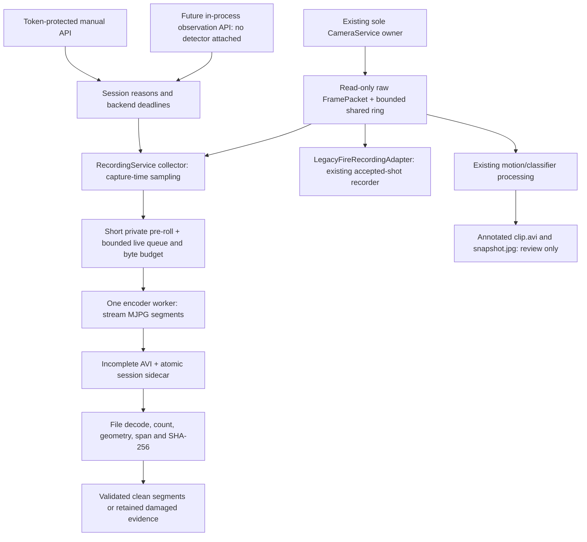
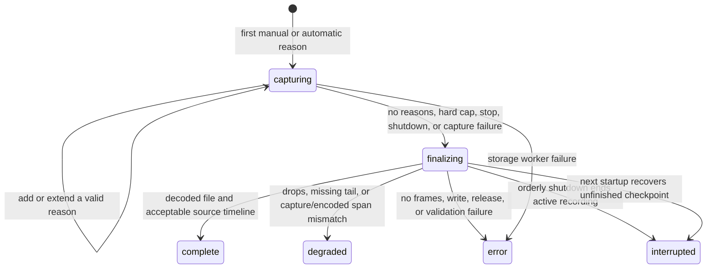

# Phase 2: clean recording and evidence authority

This phase extends the reviewed `2d7f88f9006a5a0da9f6af0214ff8b1baf829639`
baseline on `squirrel-runtime-v2`. It does not deploy software, connect a new
detector, change firing policy, or authorize hardware operation.

## Operator and integration contract

**RECORD 30 SECONDS** starts or joins one logical clean recording session.
Another press extends its manual deadline to request time +30 seconds, subject
to the maximum session duration. **STOP RECORDING** clears only the manual
reason. Independent automatic reasons keep the same session alive. Polling or
refreshing the page never extends a deadline. The UI displays the authoritative
backend state, remaining manual time, session ID, automatic reason, errors and
drop count. These controls do not invoke manual FIRE, aiming, calibration, or
valve APIs, and they work with those services unavailable.

No automatic producer is connected in Phase 2. A future trusted, in-process
worker may call:

```python
runtime.recording.extend_automatic_recording(
    event_id="event-identity",
    visit_id="visit-identity",  # optional
    observed_monotonic=packet.received_monotonic,
    reason="squirrel_detection",
)
```

The observation must use the same process monotonic clock as the shared camera.
The recorder rejects stale, future, non-finite, duplicate and regressed input.
The automatic deadline is **observation capture/receipt time + tail**, never
callback arrival time + tail. Event, visit and reason form an identity key.
Repeated observations update that reason in the same active session; they do
not repeat pre-roll. Manual and automatic reasons coexist. A request after all
reasons expire starts a new session; continuation across the hard session cap
also starts a new session, retaining any supplied visit identity.

## Ownership and bounded work



The recorder never opens a camera. Its only `VideoCapture` use decodes an
already-written file for validation. No image is resized, cropped or annotated
on the clean writer path. Production raw camera arrays reject writes; the
recorder additionally copies each admitted packet into private, read-only
encoder ownership. Review overlays use separate writable copies.

At defaults, the new service holds at most 25 private pre-roll packets per pending session, eight
queued live packets and one encoder packet, with a **128 MiB aggregate private
pixel budget** including in-flight frames. The shared camera ring is reused;
its existing FIRE window is not increased by the two-second clean pre-roll.
Producer-side queue insertion never waits for disk or encoding. One frame copy
briefly holds the policy lock; this is not a hard real-time latency guarantee.
There are at most two pending sessions, 128 segments per session, 64 source
identity keys, and 128 timeline entries. A persistent start reason and an omitted
timeline count survive timeline truncation. Detailed per-frame JSON is avoided.

## Session and file states



Each session lives under `captures/recordings/<32-hex-session-id>/` with one
`session.json` and numbered `segment-0000.incomplete.avi` files. The worker writes
the session identity before opening the writer and checkpoints metadata about
once a second. Sidecars use temporary files, fsync and atomic replacement.
After writer release, file validation checks existence/nonzero size, decoding,
frame count, native geometry and at least one frame, then hashes the file.
Only validated files lose `.incomplete` through an atomic rename. A capture vs
encoded span difference over `max(0.5 seconds, 2/FPS)` is explicitly degraded.
The AVI is constant-FPS: missing frames are not replaced by invented footage.

Generation, dimensions or maximum segment duration rotate the file under the
same session ID. Original native geometry is preserved. Sidecars record each
segment's first/last sequence, camera generation, native dimensions, first/last
monotonic and wall receipt timestamps, codec, intended FPS, written/decoded
counts, spans, finalization reason, SHA-256 and byte size. Session metadata also
records source/admitted counts, skipped sequences, drops, reason deadlines,
event/visit identities, missing tail, errors and final status. Skipped sequences
include deliberate sampling of the faster camera; they are not all camera loss.
Timestamps are receipt-after-read evidence, not sensor exposure measurements.

Restart marks old capturing/finalizing checkpoints `interrupted` with
`recovered_metadata_only` and lists retained AVI names/sizes. It does not repair
damaged AVI, resume the old session or manufacture successful validation.
Corrupt JSON and video bytes remain on disk. A blocked encoder has a bounded
shutdown join and a `shutdown_timed_out` flag; Python cannot forcibly cancel a
stuck native codec call. Hardware cleanup precedes this new recorder join.

## Roles and historical compatibility

| Media | Explicit authority | Treatment |
|---|---|---|
| New successfully validated full-frame segment | `clean_authoritative` | Native raw pixels; sidecar holds all graphics-like facts |
| `snapshot.jpg`, ordinary `clip.avi` | `annotated_review` | Existing browsing and event review remain available |
| New verified `original-frame.jpg` | `clean_authoritative` | Full-resolution raw classifier context |
| New verified classifier/training crop | `derived_crop` | Requires verified clean source; review still required |
| Unattested historical original/crop, damaged or unfinished segment | `unknown_legacy` | Readable/preserved; not automatically eligible for training |
| Existing FIRE full/aim files | Legacy compatibility evidence | Clean full-frame intent retained; no retrospective provenance certification |

Classifier schema 6 records `source_media_role` and
`source_pixel_provenance=shared_camera_raw_v1`. The completed-event path no
longer decodes a middle frame from annotated `clip.avi`. If only the generic
decoder fallback can supply pixels, its role is unknown. Retry cannot upgrade
an unattested historical source. New training inclusion and generated eligible
manifests require the clean provenance contract; the old word `unannotated`
alone is insufficient. Human labels and old files remain readable. Existing
sample files are retained, while regenerated eligible manifests can contain
fewer legacy entries. This is intentional, not lost evidence.

Review API payloads and inventory CSV/JSON expose explicit image/context/video
roles. Inventory joins recorder segments to their session IDs and does not
count segments as separate biological visits. It reports retained validation
metadata without independently re-decoding or re-hashing the copied files.
No new video is automatically a reviewed/labeled training sample. These are
trusted source/persistence contracts, not protection against manually forged
metadata or an external tool that ignores role fields.

**FIRE uses option B:** `LegacyFireRecordingAdapter` delegates the existing
record/status/close contract unchanged. It retains pre/post reservation timing,
shot identity, full-frame and aim derivative options, and separate recording
versus hardware errors. The new manual/automatic recorder is the authoritative
new session API; FIRE and ordinary review encoding are not fully unified yet.
Migrating FIRE requires separate parity evidence. No new recorder call can
actuate hardware, and no shot/control thresholds were changed.

## Configuration and storage policy

| `recording` key | Default | Rationale |
|---|---:|---|
| enabled | true in supplied YAML; false if section absent | Opt in new baseline while older configs retain behavior |
| pre_roll_seconds | 2 | Reuse modest existing pre-roll intent; maximum 2 |
| manual_duration_seconds | 30 | Requested operator behavior |
| automatic_tail_seconds | 3 | Existing ordinary event post interval |
| maximum_segment_seconds | 60 | Existing event cap; no Pi codec benchmark claimed |
| maximum_session_seconds | 600 | Conservative bounded policy; configurable up to 3600 |
| observation_max_age_seconds | 3 | Reject callbacks outside the retained capture-time window |
| target_fps / codec | 12 / MJPG | Existing evidence encoding values; AVI path validated offline |
| queue_capacity | 8 | Bounded backlog, configurable 1–32 |
| maximum_buffer_megabytes | 128 | Aggregate private pixel cap; maximum 256 MiB |
| shutdown_timeout_seconds | 2 | Bound this worker join, maximum 10 |
| minimum_free_megabytes | 256 | Preserve operating headroom; not a Pi throughput result |
| storage_budget_megabytes | 1024 | Recorder-local quota before admitting/continuing writes |

The encoder accounts actual bytes in its directory at startup, segment open
and about once a second. `GET /api/recording` and `/api/status.clean_recording`
publish byte, queue, recovery and error accounting. Low space or quota exhaustion
disables new recording admission and ends evidence work with a truthful error.
Queued/in-flight encoding and the one-second check mean the quota is a soft
write boundary, not a filesystem reservation. Other services also share the
disk and can consume headroom.

All new sessions advertise `retention_protected=true`; this phase deletes
**nothing** to make room. Active, incomplete, recovered, quarantined and training
references are therefore protected equally. New recordings are outside the
existing event-retention tree/candidates. Their separate accounting and status
are hooks for a later unified policy. Full cross-recorder retention, automatic
unprotection/deletion, reference counting and disk reservation are deferred.
Safety/runtime health takes priority by rejecting evidence work. No optional
review derivative is generated by this service, so none can consume resources
ahead of clean evidence or metadata. Ordinary review/FIRE retention is unchanged.

## HTTP additions

| Route | Contract |
|---|---|
| `GET /api/recording` | Current backend recording state; no lifetime mutation |
| `POST /api/recording/start` | Existing `X-Control-Token`; start/join manual reason |
| `POST /api/recording/stop` | Same token; clear manual reason only |
| `GET /api/recordings/<session_id>` | Retained session sidecar |
| `GET /recordings/<session_id>/<filename>` | Only manifest-listed validated complete/degraded clean segments |

Bad tokens return 403; missing recorder returns 503; unavailable/stale policy
actions return 409. Paths are constrained under the recorder directory. Existing
dashboard network exposure/authentication design is unchanged. The automatic
extension method has no HTTP endpoint in this phase.

## Validation, deployment boundary and next phase

Final offline validation: **650 passed in 129.44 seconds**, from a fresh
592-test Phase 0/1 baseline (+58). Existing FIRE, calibration, auto-fire and
rate-limit test files remain unchanged. JavaScript syntax and diff checks pass.
Detailed XML, the retained intermediate timing failure and successful follow-up,
browser observations and preservation evidence are in the durable handoff.

Use the existing local Python environment and fake-camera offline suite. The
durable handoff records final test totals, exact commits, evidence paths and
preservation verification. Tests cover backend lifetime/reason overlap,
capture-time extensions, bounded queues/bytes/identities/timeline, slow/hung and
failed writers, pixel isolation, real file encode/decode, camera transitions,
restart recovery, token/API/refresh behavior, role exclusions and FIRE parity.

A loopback-only browser harness with synthetic camera packets exercises the
real Flask routes and JS, including visible desktop/mobile controls, refresh
and STOP. This is not Pi camera, hardware or coexistence performance evidence.
MJPG disk/CPU cost and additional recorder coexistence must be measured under a
separately authorized Pi pass. The ordinary motion path still emits annotated
review media, and the existing night-pause policy remains in that path; explicit
manual recording is independent of motion/night/classifier availability.

Phase 3 may separately build the versioned Model A v3 NCNN adapter and
latest-frame approximately 2 Hz worker, initially **control-incapable**. This
phase only supplies its recording API. Do not synthesize legacy person-clear
results from a one-class detector. The existing MobileNet/VOC path, actuation
coordinator, durable attempted-shot ledger, calibration and all operational
numbers remain the Phase 0/1 baseline.

## Rollback

On a reviewed future installation, disabling `recording.enabled` disables the
new worker and controls without changing FIRE. Preserve the recording directory
and sidecars before any installation rollback. For source review, create a
separate worktree at the Phase 0/1 baseline above or revert Phase 2 commits in
reverse order on this branch; do not reset the original dirty checkout or field
branch. Do not delete generated media or undo Phase 0/1 safety changes. Reverting
the media-role fix would restore the old annotated fallback risk. Git operations
do not deploy or restart the Pi.
