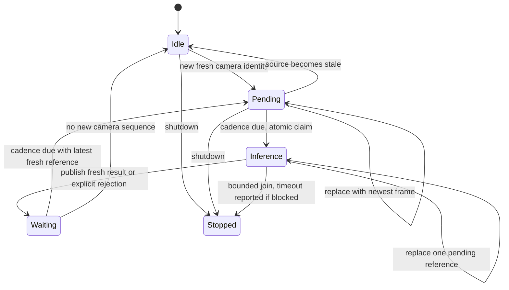
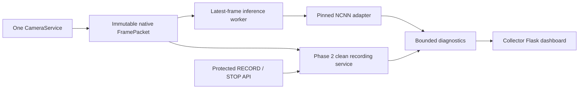

# Phase 3: versioned detector and control-incapable collector

Model A v3's verified best checkpoint is epoch **149**, exact external AP50–95
**0.6256842839174807**. The epoch-150 final model differs. The exported EMA weights
passed FP32 NCNN equivalence. This software is ready for separately authorized
Pi collector/coexistence validation; no field deployment or timing claim is made.

## Sealed model and readiness

The permanent bundle is
`D:\Squirrel_Squirter_ML_Rebuild\07_models\model_a_v3_yolox_nano\deployment\v3-epoch149-fp32-416-r1`.
Source checkpoints, logs, environment freeze, training configuration, manifests
and all epoch checkpoints remain in the sibling `extracted_results` area. The
downloaded archive is unchanged. Large model artifacts remain outside Git.

| Item | SHA-256 |
|---|---|
| Download archive | `4ac2d01a0bde444b0821796966986c30909c65e898c419ce5b2ca19e05559b30` |
| Best checkpoint, 7,581,047 bytes | `5d8b78244107302881477bda95353236f29356c23a2a10f61936225c4dfc4831` |
| NCNN param, 24,722 bytes | `18f83f0d8450e65f3adc131d2633036cef51a3d872b99058f6e284d2bce93620` |
| NCNN bin, 3,557,264 bytes | `78e7c91742549a04ba05e306734e0e395b386d9709b8446eb5b0ba9112f4b939` |
| Manifest | `85d2f64c89f3e6c0499f594390b05fe509ec9934ea1c40d19ab4a6122db46501` |
| Equivalence report | `7c1b3108a620a5b439af8ff93b5eb4f165d2fc5fad44c0acc3e62de338362439` |

Runtime pins the manifest SHA independently in configuration. The strict v1
schema rejects unknown fields, duplicate keys, wrong classes, unsupported
contracts, false readiness, wrong backend version, path escapes, wrong sizes or
hashes, and equivalence evidence that does not bind the checkpoint and model
artifacts. A filename is never readiness. Keep the bundle immutable after
verification; this is startup identity verification, not continuous filesystem
attestation or a digital signature against an attacker who can edit config.

The manifest's `ready: true` means **offline export ready for this collector**.
It does not mean field coexistence, firing, threshold or biological visit policy
has passed. NCNN `1.0.20260526` CPU FP32 is explicitly supported. The optional
Python dependency group is `detector`. Availability of an ARM64 wheel and actual
Pi runtime behavior still require the separately authorized field pass.
The adapter explicitly disables FP16 packing/storage/arithmetic, BF16 storage
and INT8 inference to enforce this FP32 contract on the target runtime.

## Exact adapter contract

Input is native uint8 BGR HWC. Resize by `min(416/height,416/width)`, floor each
resized dimension, use OpenCV linear interpolation, and place at top left of a
114-filled square. Convert to contiguous CHW float32 with **no normalization**.
Source arrays are never written. NCNN receives `in0`; `out0` is raw `[3549,6]`.
Decode grids at strides 8/16/32, `xy=(raw_xy+grid)*stride`,
`wh=exp(raw_wh)*stride`. Confidence is objectness × squirrel score. Class-agnostic
greedy NMS uses IoU 0.65; inverse scale and clip to native image dimensions.
Zero-area clipped boxes are discarded. Non-finite tensors/geometry and invalid
probabilities make the result unavailable. The class list is exactly `squirrel`.

`SquirrelDetectorAdapter` is model-independent. `NcnnSquirrelDetector` implements
the pinned contract and serializes inference. Every successful or failed loaded
model output carries immutable model/version/checkpoint/manifest/artifact
identity. Failure before a model is identified explicitly has null identity and
an unavailable error. There is no camera-opening, graphics or control API in
the detector. Its status lock is independent of inference, so a blocked native
call does not block reading adapter status.

## Latest-frame scheduling



One camera consumer borrows raw read-only references independently of motion
events. One inference owner claims work under a lock. There is at most one frame
in inference and one pending reference; pending frames overwrite, never enqueue.
At 2 Hz, fast inference keeps start-to-start cadence. If inference takes at least
one interval, the next opportunity is completion + one interval. Missed slots
are discarded, so there is no catch-up burst. This deliberately reduces cadence
under overload. A camera sequence is never inferred twice. CameraService's
sequence is lifetime-monotonic even on reconnect; a replacement service must
use a new worker. Generation and resolution changes invalidate pending/results
and invalidate an old in-flight completion.

Source age uses packet receipt-after-read monotonic time, **not callback arrival**.
It is not sensor exposure time. Old/future/non-finite source times are rejected;
age is checked again before inference and on completion. Expired results remain
diagnosable but their detections are hidden and availability is false. Result
identity includes generation, sequence, native dimensions, source monotonic and
wall time, inference start/end and capture-to-result age. Track/event/visit fields
are explicitly null seams for Phase 4; a detection does not assert a new visit.

Shutdown clears pending/results and joins both threads against one deadline.
Python cannot forcibly interrupt a hung native NCNN call; its daemon may remain
alive until process exit, with `shutdown_timed_out=true`. This worker cannot be
restarted to create another inference owner after stop.

## Collector architecture



`collector_app.CollectorRuntime` constructs only camera, detector, worker and
clean recording. Its dedicated Flask app never calls normal runtime/dashboard
builders and has no servo, valve, manual-control, AutoFire, GPIO or PCA9685
service. Tests prohibit construction of these services and their full-runtime
factories. Construction does not start the camera. `start()` is explicit and
failure unwinds owned resources. No real camera was opened during this pass.

The operational motion/tracker and legacy MobileNet paths are retained. This
minimal collector currently runs camera + detector + clean recording + diagnostics;
it does not run the faster tracker yet. Thus its local tests cannot demonstrate
full tracker coexistence. Recurring full-frame inference has no motion-event
gate and can inspect stationary squirrels. Later association can consume exact
native boxes and source identity without changing the legacy path today.

Manual recording reuses Phase 2's clean pixels and bounded writer. The automatic
extension hook remains available in process, but no detector producer is attached.
A fake-only contract test uses source time and no biological visit assertion.
No detector-positive recording or firing trigger is enabled.

## Configuration and API

The new `detector` section defaults to disabled. Old classifier/config values are
unchanged. The normal operational application does not instantiate this detector;
use the explicit collector composition for future validation. Its default
listen address is loopback. A future authorized invocation is:

```text
python -m squirrel_shooter.collector_app --config <reviewed-collector-config.yaml>
```

That command starts a camera and is **not an instruction to run it on the Pi in
this phase**. For an authorized collector config set `enabled: true`, an absolute
`manifest_path`, and the independently pinned `manifest_sha256` above. Cadence is
2 Hz; maximum source/result ages are 0.75/1.5 seconds; diagnostic floor is 0.01;
threads default to a configurable provisional 2. None is a firing threshold or
a field performance decision. Recorder settings remain governed by Phase 2.

| Route | Behavior |
|---|---|
| `GET /` | Minimal collector diagnostics and RECORD/STOP controls |
| `GET /api/status` | Collector role, camera, recorder, detector state |
| `GET /api/detector` | Full detector/worker diagnostics |
| `GET /api/recording` | Backend recording state |
| `POST /api/recording/start` | Backend-owned manual recording deadline |
| `POST /api/recording/stop` | Clear manual reason; preserve independent automatic reasons |

Recording POSTs require the page's `X-Recording-Token`. This protects against
cross-origin form requests; it is not multi-user authentication. Physical-control
and calibration routes do not exist. API tests exercise actual Flask routes and
template rendering with fake camera/codec dependencies. No browser visual
performance or Pi dashboard throughput is claimed.

Telemetry includes configured/enabled, model identity, manifest/hash status,
backend, nominal cadence, source sequence/current age, inference latency,
capture-to-result age, count/top confidence, worker state, in-flight/pending,
cadence skips, superseded frames, stale-before/stale-after and unavailable counts.
Cadence skips count fresh submissions arriving before the next due time; they
are not all camera frame drops. One last result, one last drop and 128 latency
samples are retained. No per-frame disk logging/fsync occurs in the detector.

## Validation and rollback

The original v2 acceptance limits remain: matching detection counts, confidence
delta <=0.0005, coordinate delta <=1 native pixel and matched IoU >=0.995.
Twenty approved non-protected optimizer-training images plus two synthetic empty
frames passed: 10 empty outputs, 9 low-confidence matched detections, maximum
confidence delta 3.8743019104003906e-7, maximum box delta 0.000152587890625 pixels,
minimum IoU 0.9999937510740341. These images are conversion checks, not an accuracy
benchmark or model selection. No Golden/locked-validation images were inferred.
The real runtime adapter separately replayed all 22 and revalidated bundle bytes.

The source suite and real bundle checks are recorded in the durable Phase 3
handoff. Existing FIRE/control/calibration/rate and historical event tests remain
unchanged. Source archive/member/checkpoint identities were reverified after
extraction and export. No Pi, RunPod, training, calibration or actuation action
occurred.

Rollback for diagnostics is to stop the collector and use the preserved legacy
entry point with detector disabled. No Pi rollback is required because nothing
was deployed. To inspect Phase 2, create a new unused detached worktree at
`2cc47887cbcca472a2b5cb9942a1afad4846ed66`; do not reset/clean existing worktrees or
rewrite the published branch. Any future published rollback should be reviewed
revert commits. The next phase requires separate Pi authorization and must measure
capture-to-result ages, inference p50/p95/p99, CPU/RSS, camera/recorder drops,
tracker timing, temperature, frequency/throttle flags and full workload behavior.
