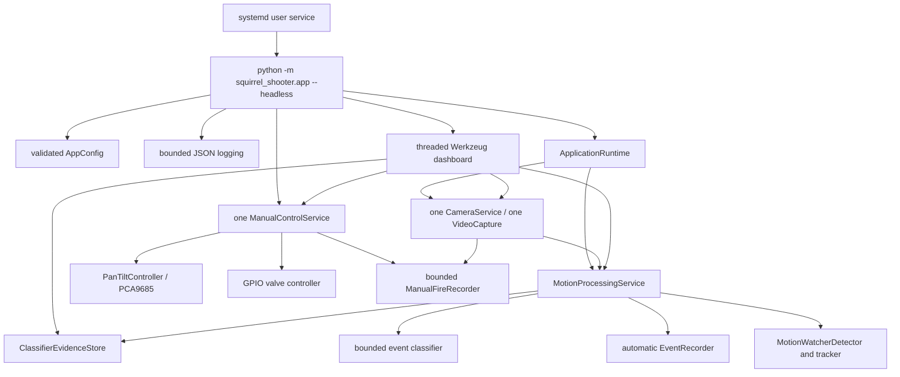

# Squirrel Squirter performance, architecture, and Raspberry Pi audit

Date: 2026-08-10

Branch: `manual-control`

Pre-audit baseline: `04a2a7ec771c62b9764dad50798686dff973241e`

Scope: complete production application, supporting tools, browser clients,
service lifecycle, and relevant Git history. `Misc/` was excluded completely.

## Executive conclusion

The production design now has the right basic shape for V1: one camera owner,
rate-decoupled consumers, event-driven classification, a single shared MJPEG
encoder, centralized physical control, and bounded queues/history. The manual
servo, calibration, PARK, valve, and cooldown code does not contain a continuous
worker and is not a credible explanation for sustained idle CPU.

The best-supported historical explanation is that older camera/detector work
first reached the field Pi during the August manual-control deployment:

1. `c4cf982` made a full-resolution inclusion-zone annotation substantially
   more expensive while annotation and JPEG generation still ran on every
   processed frame.
2. `cbb3664` added unconditional MOG2 background extraction and localized
   lighting analysis to that already-continuous path.
3. The August 8 manual-control foundation reused the existing camera and added
   no background servo loop. Its initial browser poll was too fast, but that
   cost existed only while the page was open and was reduced to one serialized
   GET per second before the August 9 field update.
4. Manual recording was added later on August 9 and cannot explain the original
   pre-recording temperature jump, although its first implementation did add a
   separate continuous idle cost.

There is unavoidable ambiguity: Git cannot prove which SHA, process set, camera
mode, Python/OpenCV build, or open browser pages were on the Pi at the exact
thermal transition. If `c4cf982` and `cbb3664` were already physically deployed
and cool before removal, repository history alone cannot explain the abrupt
change.

This pass removes additional continuous memory traffic, lifetime growth,
filesystem polling, request logging, hidden-view streaming, failure-loop risk,
and observability gaps without changing detection rates or physical-control
safety. The dominant zero-viewer work that remains is expected to be USB MJPG
capture/decode plus the 640-pixel-wide MOG2/blur/morphology/global-measurement
pipeline at 10 FPS. Only the physical validation protocol can decide whether
the resulting Pi 4 deployment is cool enough.

## 1. Current production architecture



Startup validates YAML, sets OpenCV to one native worker, configures logging,
constructs one `CameraService` and one `MotionProcessingService`, then starts the
camera, classifier, and motion workers. When the dashboard is enabled, the
runtime builds one `ManualControlService` and injects the already-created camera
and motion services into Flask with `start_camera=False` and
`start_vision=False`. There is no second production camera instance.

The main loop sleeps for 500 ms in headless mode, emits best-effort aggregate
telemetry every 30 seconds, and supervises the essential motion worker plus the
camera worker on Raspberry Pi hardware. An essential-worker death causes orderly
hardware/runtime cleanup and a nonzero exit so `Restart=on-failure` can act.
Dashboard-server death remains nonfatal so unattended detection can continue.

Shutdown order is HTTP server, fail-safe manual-control cleanup, motion/classifier,
then camera release. Manual cleanup closes the valve before servo cleanup and
before waiting for evidence-worker completion.

## 2. Subsystem ownership and cost map

| Subsystem | Owner / creation | Execution and rate | Inputs and outputs | Material cost |
|---|---|---|---|---|
| Configuration | `app.main` / `load_config` | Startup only | YAML to immutable dataclasses | File read and validation only |
| Camera capture | `ApplicationRuntime.camera` | `camera-capture`; blocking `VideoCapture.read`, requested 15 FPS | USB MJPG to 1280x720 BGR | MJPG decode, one defensive publication copy |
| Raw pre-roll | `CameraService` | Sample references at 12 FPS; time bounded | Published BGR references | RAM retention, no idle JPEG/video encode |
| Motion detector | `MotionProcessingService.detector` | `motion-detect`; paced at most 10 FPS | BGR to reduced masks/groups | Continuous primary headless CPU |
| Tracker | `MotionWatcherDetector` | Same motion thread | Groups to bounded tracks | Small normally; pathological group x track comparisons |
| Automatic events | `EventRecorder` | Same motion thread, only active event | Annotated frames to MJPG AVI/JPEG/JSON/logs | Transient CPU, disk, and detector stalls |
| Classifier | `EventClassifier` | `classifier`; bounded queue of one | One selected event crop to MobileNet-SSD evidence | Event-driven 300x300 DNN burst |
| Dashboard HTTP | `DashboardServer` | `dashboard-http` plus request threads | Status/events/review/control | Small when idle; long-lived thread per stream |
| MJPEG | `CameraService` | Lazy `mjpeg-encoder`; at most 8 FPS with viewers | Latest annotated BGR to one shared JPEG | Viewer-only annotation, JPEG, network |
| Manual coordinator | `ManualControlService` | Request thread, no background loop | Token-gated commands to pan/tilt/valve | Negligible stationary; finite I2C/sleeps per action |
| Calibration/aim | Same coordinator | Request driven | Stored anchors/click to inverse-bilinear aim | Small Python geometry; AIM never fires |
| PARK/cooldown | Same coordinator | Request/action driven, monotonic time | Command state | No polling thread |
| Manual evidence | `ManualFireRecorder` | One lazy executor worker; at most two pending | Borrowed raw frames to full/zoom AVI/JPEG/JSON | Roughly seven-second RAM/encode/disk burst |
| Storage/retention | Motion/event/report code | Startup, event completion, shutdown | Event tree and logs | Recursive scans and synchronous I/O |
| Logging | Root logger | State/event driven plus 30-second metric | JSONL and journald | Bounded rotation; successful routine polls filtered |
| systemd | User unit | One process, restart on failure | SIGINT, 30-second stop budget | Cannot prevent a separately launched camera tool |

## 3. Long-running thread inventory

| Thread | Creation | Wake/block behavior | Frame/inference/encode/I/O work | Historical status |
|---|---|---|---|---|
| `MainThread` | Python/app entry | `Event.wait(0.5)` headless; 50 ms preview loop otherwise | Lifecycle, worker supervision, 30-second telemetry | Existing combined runtime; telemetry/supervision added here |
| `camera-capture` | `CameraService.start` | Blocking camera read; 50 ms failed-read wait; 2 s reconnect | MJPG decode, publication copy, buffer references | Combined runtime since July 16 |
| `motion-detect` | `MotionProcessingService.start` | Explicit rate wait plus camera `Condition` | Detector, tracker, annotations/events, event disk work | Combined runtime since July 16 |
| `classifier` | `EventClassifier.start` | Bounded `Queue.get(timeout=.2)` | Lazy model load, one event inference, evidence writes | Event driven |
| `dashboard-http` | `DashboardServer` | Werkzeug `serve_forever` | Accepts request workers | Combined runtime |
| Werkzeug request workers | Server on demand | Request lifetime; MJPEG request is long lived | JSON/static/control or socket write | One per active request/client |
| `mjpeg-encoder` | First MJPEG viewer | Camera `Condition`; sleeps with no viewers | One shared JPEG representation | Previously continuous; now demand driven |
| `manual-recorder` | First accepted FIRE task | Executor task; waits for post-roll then writes | Full and zoom MJPG plus JPEG/JSON | Added August 9; worker is lazy |
| `squirrel-vision` | Legacy `VisionService` only | Uncapped old frame loop | Continuous annotation and `imencode` | Not constructed by production; maintenance risk |

No servo, valve, calibration, targeting, cooldown, PARK, or status background
thread is created by the Python application. Stationary servo state therefore
consumes no application CPU beyond browser-request status serialization.

## 4. Camera ownership and every production consumer

The physical path is:

```text
USB camera MJPG -> one VideoCapture.read -> BGR ndarray -> one published copy
  -> latest raw reference
  -> sampled raw pre-roll references
  -> motion-detect borrowed reference
       -> two-second detector prebuffer references
       -> conditional automatic-event annotations/writer
       -> selected classifier frame after completion
       -> transferred latest annotated frame when display is demanded
  -> manual FIRE pre/post-roll borrowed references
  -> shared MJPEG encoder reads latest annotation
```

Production consumers are the motion detector, camera raw buffer, detector
prebuffer, automatic event writer, classifier selection, dashboard/manual live
view, local preview, and manual evidence recorder. Calibration and click-to-aim
do not open or transform a separate camera feed; browser SVG/HTML overlays sit on
the same stream. The original dashboard and manual page therefore share the
same encoded JPEG bytes.

Standalone camera preview, capture, diagnostic, and mask tools do open a camera
directly. They are not part of systemd production, but there is no process-wide
advisory lock. The operator must stop the service before running them.

## 5. Encoding, resize, conversion, copy, and serialization paths

### Production encoding paths

| Path | Trigger/rate | Representation | Reuse |
|---|---|---|---|
| Shared MJPEG `cv2.imencode` | Viewer demand, max 8 FPS | Annotated full-resolution JPEG | Encoded once, byte string shared by all viewers |
| Automatic `VideoWriter` | Active accepted motion event, motion cadence | Annotated MJPG AVI per active event | Required event evidence |
| Automatic snapshot `cv2.imwrite` | Event completion | Annotated JPEG | One selected/latest frame |
| Classifier evidence `cv2.imwrite` | Completed qualified event or retry | Crop, original, metadata | Once per classifier task |
| Manual full `VideoWriter` | Accepted FIRE only | Raw full-field MJPG AVI | Asynchronous after valve cleanup |
| Manual zoom `VideoWriter` | Accepted FIRE only | Cropped/resized 1280x720 MJPG AVI | Separate required replay representation |
| Manual snapshot `cv2.imwrite` | Accepted FIRE only | Zoom review JPEG | One per completed recording |

`camera_capture.py`, preview/mask tools, and legacy `VisionService` contain other
encoding paths but are not instantiated by `squirrel_shooter.app`.

The owner-observed earlier “three encoders per frame” measurement is retained as
physical evidence. Preserved Git at the pre-optimization SHA proves two explicit
always-on production Python `cv2.imencode` sites: raw capture JPEG and annotated
dashboard JPEG. The third may have been camera MJPG decode/re-encode work, a
recording representation, or an uncommitted/intermediate runtime; Git does not
support claiming three distinct preserved Python call sites.

### Continuous detector transforms

Each selected 1280x720 frame is resized to about 640x360 with `INTER_AREA`,
Gaussian-blurred, updated through three-channel MOG2, shadow-thresholded, masked,
morphologically opened/closed, and contour-scanned. Global measurement performs
grayscale/colorfulness and foreground calculations. Qualifying contours can add
MOG2 background extraction plus localized-lighting ROI masks, `float32` BGR
arrays, grayscale arrays, chromaticity division, and differences.

Annotation, only for a viewer or event, copies the full frame, resizes the
static zone mask to full resolution, creates a dark overlay, blends it, draws
static contours/text/boxes, and hands ownership to `CameraService`. Manual zoom
recording crops then resizes every retained frame back to 1280x720. Classifier
preprocessing crops once, then OpenCV DNN makes a 300x300 blob.

## 6. Allocation and memory-bandwidth findings

A 1280x720 three-channel frame is 2,764,800 bytes, or about 2.64 MiB.

Before this pass, the current raw pipeline made roughly:

- 15 publication copies per second;
- 12 separate raw pre-roll copies per second;
- 10 motion-consumer copies per second;
- 10 detector-prebuffer copies per second.

That is about 47 full-frame destination copies per second: approximately
124 MiB/s of destination writes, plus the corresponding reads and allocator
churn. The revised path makes the one defensive 15 FPS publication copy and
shares immutable references internally, about 40 MiB/s of destination writes.
It removes roughly 84 MiB/s of destination writes (about twice that amount of
read-plus-write traffic) without assuming that the Pi camera backend owns each
returned buffer permanently.

At idle, the 3.4-second sampled camera window and two-second detector prebuffer
retain overlapping references instead of duplicate arrays. Exact unique memory
depends on which 15 FPS sequences are sampled by the 12 and 10 FPS consumers.
During manual FIRE, about 84 sampled frames over seven seconds can still keep up
to roughly 221 MiB of unique raw pixels alive before encoding. That is intentional
evidence retention and remains the largest expected transient RAM load.

The best-event selector formerly copied every active-event frame before deciding
whether to retain it. It now ranks first and copies only when the first,
configured-fallback, or best role changes, reusing one stored frame when roles
coincide.

## 7. Detection and tracker workload

The detector already operates at a lower rate and resolution than capture. The
static reduced inclusion-zone mask is precomputed for detection. MOG2 background
retrieval is now candidate-gated rather than unconditional, a correction made in
the earlier `50a8364` optimization.

Current likely steady headless rank is:

1. USB MJPG decode inside `capture.read`;
2. MOG2, Gaussian blur, resize, and morphology;
3. global grayscale/color metrics and mask reductions;
4. the publication memcpy and memory/cache traffic;
5. contour/group/tracker work in active scenes.

Grouping can still be O(component squared) in a highly fragmented scene, and
tracker assignment is group by active track, though tracks expire quickly.
Localized-lighting analysis is an active-scene hotspot, not a quiet-scene
constant after candidate-gating.

Tracker path history was unbounded for a continuously matched track, and
average/max speed rescanned its lifetime list. It is now `deque(maxlen=30)` with
running speed count/sum/peak. Output semantics remain the prior last-30 path plus
lifetime average/peak.

## 8. Classifier workload

The classifier is MobileNet-SSD through OpenCV DNN. It receives one selected
candidate crop after an automatic event completes, builds one 300x300 blob, and
runs one `net.forward`. It does not run at capture or detection FPS. Its queue is
bounded to one; queue-full evidence is explicit rather than silently growing.

Completion-rate timestamps are pruned on append as well as status, preventing a
headless lifetime list. The classifier-review store now makes one locked scan,
caches its grouped overview for ten seconds from scan completion, invalidates on
classification/human review, and returns defensive deep copies. External
retention changes become visible within the bounded TTL.

Inference is therefore unlikely to explain continuous idle heat. It can be a
short event burst and should be measured separately from detection.

## 9. Dashboard, browser polling, Flask, and network

Browser rates are:

- dashboard status: every 5 seconds;
- dashboard recent events: every 2 seconds;
- classifier review: every 3 seconds;
- manual-control state: one serialized GET per second while visible.

Each dashboard endpoint has its own in-flight guard and eight-second GET abort,
so requests cannot overlap indefinitely or serialize unrelated endpoints. Polls
pause when the document is hidden and refresh on return. Manual control preserves
its one-second visible calibration synchronization; only its GET is abortable,
never a control POST.

The dashboard detaches MJPEG when hidden, in review/inspect mode, or explicitly
paused. The manual page detaches it while hidden. One shared encoder serves all
pages and viewers. Additional viewers add socket/Tailscale copies and one
long-lived Werkzeug request thread each, not another OpenCV/JPEG producer.

Recent-event API callers retain the previous full-record contract by default.
The console explicitly requests ten compact summaries, avoiding repeated network
serialization of large `group_samples`/components. Initial dashboard rendering
enriches five events. The archive enriches only the requested page. Classifier
overview and legacy capture counts are cached.

Routine successful polling/stream access records are filtered while 4xx/5xx and
rejected control-token requests remain visible. This avoids about one access
line per second per dashboard (plus one per second for manual) being written to
both the application log and journald. Application JSONL now rotates by size.

Estimated stream egress is `last JPEG bytes * actual shared stream FPS * viewer
count * 8`. It is exposed with JPEG size/encode time so `tailscaled` CPU can be
correlated with application traffic. It is an estimate: socket/TCP/Tailscale
overheads are additional.

## 10. Manual control, servo, valve, calibration, PARK, and safety

All physical commands remain centralized in one `ManualControlService` lock and
the existing `PanTiltController`/valve instances. Servo movement is a finite
sequence of I2C writes and sleeps; there is no fictional position-feedback poll.
Calibration reads/writes are request driven and cached by the backend.

FIRE and PARK reject overlap. AIM moves and settles but never opens the valve.
The valve starts OFF, is closed before opening, and closes in `finally`.
Cooldown begins from monotonic confirmed valve closure. PARK is separate from
CENTER and occurs only after the valve is OFF.

This pass did not change:

- the 0.40-second FIRE pulse;
- the 10-second backend cooldown;
- GPIO24 active-high configuration or LOW/OFF cleanup;
- servo limits or park angles;
- calibration/interpolation behavior;
- the random control token contract;
- normally-closed valve behavior;
- move, settle, fire, cooldown/PARK sequencing.

Software tests do not validate commanded physical position, I2C, PCA9685,
GPIO voltage, MOSFET, solenoid, water flow, or field targeting.

## 11. Manual FIRE recording

Recording still begins only for an accepted physical FIRE and remains about two
seconds of pre-roll plus five seconds of post-roll on monotonic elapsed time.
It preserves the full-field clip, zoom replay, snapshot, event metadata, crop
source, and actual playback FPS calculation.

Idle support now shares raw published frame references. The worker queue is one
active plus at most two pending tasks; a rejected submission is counted in
`failed`/`rejected` telemetry and records its last error without changing the
already-completed valve pulse or cooldown. Full and zoom encoding stays outside
the physical-control lock, after valve closure.

Residual transient cost is high by design: seven seconds of raw retention,
followed by full and zoom 1280x720 MJPG encodes while monitoring continues.
Writing zoom at its natural smaller resolution would reduce pixels but changes a
delivered artifact contract, so it was not done silently.

## 12. Storage, logging, retention, and long-run boundedness

Corrected lifetime-growth defects:

- Session FPS changed from an unbounded per-frame Python list plus O(runtime)
  sum/min/max every save to running count/sum/min/max.
- Session exception and retention detail arrays retain the latest 100 entries
  plus lifetime counts.
- Tracker paths and classifier completion times are bounded.
- Manual recording and classifier queues are bounded.
- Active application logs rotate by configured size/count.

Session JSON persistence now follows the 30-second telemetry cadence instead of
ten seconds. Motion exceptions use exponential backoff and signature-aware
30-second repeat suppression. A different error is never hidden behind the prior
signature, and suppressed bursts are summarized on recovery/finalization.

Remaining storage cost is architectural: startup report generation and event
loading scan the tree; automatic-event retention recursively parses/stats stored
events on `motion-detect`; report generation can run at shutdown; manual-only
events do not trigger immediate retention. Full recent records may contain many
group samples. A future central event index/maintenance worker is higher value
than scattered micro-caches, but was deferred because it changes persistence and
deletion ownership.

## 13. Locks, queues, retries, and fault handling

Image processing, DNN, JPEG, and manual evidence encoding do not hold the
physical-control lock. Camera publication holds its `Condition` only for pointer
and status changes; trusted hot consumers borrow immutable references. External
copy-default APIs remain defensive.

Normal waits/backoff are:

- camera read failure: 50 ms; reopen after configured failures; 2-second retry;
- motion failure: 0.25, 0.5, 1, 2, 4, then 5 seconds;
- classifier queue/paused waits: 200 ms;
- MJPEG no viewer: blocking `Condition`;
- MJPEG encode failure/exception: at least one-second retry, warning limited to
  30 seconds, failure/worker health telemetry;
- main headless loop: 500 ms;
- browser GET: in-flight guard plus eight-second abort.

Camera sample-deadline catch-up now advances arithmetically rather than looping
once for every missed 12 FPS slot after a long outage. The MJPEG teardown race
cannot leave zero viewers with nonzero stream FPS. Telemetry exceptions are
best-effort and cannot terminate otherwise healthy application work.

The main loop now exits nonzero if the essential motion worker or Pi camera
worker dies, allowing systemd recovery. A separate manually launched camera tool
can still contend with the service; adding a cross-process advisory lock remains
a useful reliability improvement.

## 14. Historical regression reconstruction

### Best evidence for known-good and first suspicious commits

The last retained live Pi audit identifies
`180039125346881eeac629defa5e498b57ca812b` (July 25) with service, camera, and
detector healthy. It did not record a temperature, so it is the best likely
known-good rather than a thermally proven baseline.

`c4cf98234cbd26cfbf467ef67b2dc7bbab136f4c` (July 26) is the strongest first
suspicious commit. It replaced simple per-frame boundary drawing with
`draw_inclusion_zone`, which at that time ran full-resolution mask resize,
bitwise masking, dark overlay allocation/blending, and contour drawing while the
motion loop still followed camera rate and published/encoded annotations even
headless.

`cbb3664f0c288734051cb302d9d0603ec5ef5729` (July 28) is the second strong
incremental suspect. Its original localized-lighting filter fetched the MOG2
background unconditionally every detection frame and added per-contour ROI work.

An older enabling architecture,
`680bd275e56cec9ddb7885d2f17eacab14722335` (July 16), combined watcher and
dashboard around one camera but consumed every camera frame without a detector
rate cap. At the historical state, capture encoded raw JPEG continuously and
motion annotated/published JPEG continuously. This was longstanding cost, not an
August-authored regression, but it amplified later per-frame work.

### August timeline

| Date / commit | Runtime significance | Regression assessment |
|---|---|---|
| Aug 6-7 | No repository commits | Physical transition window, but no authored change to blame directly |
| Aug 8 `62b3428` | Builds one `ManualControlService`, same camera/motion; adds manual page | Low headless suspicion; no worker/second camera |
| Aug 8 `9f860ad` | Two-device calibration; initial 250 ms page poll reduced/serialized to 1 s | Viewer-only request cost corrected before Aug 9 deployment |
| Aug 9 through `2505da1` | Servo, GPIO, calibration, click-to-aim | Camera/detector/classifier/event/service files byte-identical to the servo base; synchronous commands only |
| Aug 9 `b52f9c1` | Adds manual recording/pre-roll | Real later cost, excluded as cause of the original pre-recording heat |
| Aug 10 `08984e2` | Removes continuous UI/raw encoding work, rate decoupling | Major CPU correction |
| Aug 10 `50a8364` | Demand-driven annotations, raw sampled pre-roll, OpenCV one thread, candidate-gated background | Deeper idle correction |
| Aug 10 `04a2a7e` | Pulse changes to required 0.40 seconds | No idle performance effect |

The direct pre-recording range from the servo base through `2505da1` leaves
`camera_service.py`, `motion_runtime.py`, `watch_detection.py`, `classifier.py`,
`event_storage.py`, and service/start files byte-identical. PCA9685 and GPIO
commands are synchronous and finite. The manual branch may nevertheless mark
when the older July camera/detector commits first reached the physical Pi.

## 15. Development profiling evidence

A deterministic Windows development profile used Python 3.14, OpenCV with one
thread, twelve seeded random 1280x720 frames, 30 warm-up frames, and 100 measured
detector frames. This is synthetic, creates near-constant global scene change,
and is not a Pi or field-camera benchmark.

Results:

- 100 frames: 1.085576 seconds, 10.856 ms/frame;
- MOG2 `apply`: 0.652 seconds;
- global measurement: 0.123 seconds;
- Gaussian blur: 0.102 seconds;
- resize: 0.064 seconds;
- channel split: 0.063 seconds;
- morphology: 0.048 seconds;
- one full 1280x720 copy: 0.566 ms average over 500 copies.

This supports the hot-path ordering and copy-bandwidth work. It does not predict
Pi CPU percentage, temperature, detection quality, or throttling.

## 16. Operating-mode incremental cost

| State | Expected work |
|---|---|
| A: headless, quiet | 15 FPS MJPG capture/decode; one publication copy; 10 FPS reduced detector; raw reference buffers; 30-second telemetry/session write |
| B: one dashboard viewer | A plus up to 10 FPS annotation, one shared 8 FPS JPEG, one socket/Tailscale stream |
| C: manual/click-to-aim viewer | B plus one small visible one-second state GET and browser overlays; targeting work only on click |
| D: active motion | A/B plus contours, localized-light analysis, grouping/tracking; possible event annotation/writer |
| E: classifier | One asynchronous 300x300 DNN inference and evidence writes after event completion |
| F: servo movement | Finite I2C writes and sleeps in one request; no sustained idle work afterward |
| G: FIRE plus recording | 0.40-second valve pulse, confirmed close, PARK/cooldown; async seven-second raw collection then two MJPG clips and snapshot/JSON |

## 17. Optimizations implemented in this pass

High-value, low-capability-risk changes:

1. One defensive camera publication copy per capture; trusted motion, pre-roll,
   detector-buffer, annotation-transfer, and manual-recorder paths share
   immutable references.
2. Best-frame candidates are ranked before copying.
3. Session FPS and tracker histories use bounded/O(1) aggregates; session detail
   lists and classifier completion windows are bounded.
4. Manual recording pending work is bounded and rejected evidence is observable.
5. Classifier overview scans are cached from completion and invalidated on
   writes; callers receive defensive copies.
6. Dashboard recent/classifier/capture work is limited, cached, paginated early,
   or compactly projected while preserving default API compatibility.
7. Hidden/inspect/paused pages detach video; GET polls are per-endpoint
   serialized, hidden-paused, and timeout-bounded.
8. Routine successful poll access logs are filtered without hiding 4xx/5xx;
   application JSONL rotates.
9. Motion failure paths back off, suppress only identical repeats, preserve
   distinct errors, and flush summaries.
10. MJPEG false/exception failures back off and remain observable; teardown
    metrics are race-safe.
11. Long-outage raw-buffer scheduling is O(1).
12. 30-second best-effort telemetry covers FPS, major cumulative stage times,
    per-thread CPU estimates, viewers, JPEG size/egress, classifier, manual
    recording, and temperature.
13. Essential-worker supervision converts silent partial death into safe cleanup
    and a systemd-restartable nonzero exit.
14. Configuration and owner documentation now include the telemetry cadence and
    exact physical measurement protocol.

## 18. Considered but intentionally not implemented

- **Lower detection/camera/dashboard rates or resolution:** not changed without
  Pi measurements and recorded-animal sensitivity validation.
- **Change MOG2, blur, morphology, masks, or localized-light thresholds:** these
  affect detection behavior; stage-level Pi evidence must come first.
- **Remove overlays, classification, recording, live video, or manual features:**
  rejected as capability loss rather than waste removal.
- **Eliminate the final camera publication copy:** unsafe until the actual Pi
  backend proves returned arrays are independently owned and never reused.
- **Natural-resolution zoom AVI:** attractive event CPU reduction, but changes
  the replay artifact contract.
- **Asynchronous automatic event writers:** multiple concurrent encoders and
  ordering/crash semantics need a deliberate bounded design.
- **Central event index/maintenance worker:** high-value next architecture work,
  but retention/deletion/report ownership deserves its own migration and tests.
- **Rewrite/deleting legacy `VisionService`:** it is inactive but may support
  compatibility/tests; quarantine/deprecation is safer than a broad refactor.
- **Process-wide camera advisory lock:** useful RAS hardening, but must cover all
  standalone tools and service/manual workflows consistently.
- **Dedicated inference accelerator:** the current OpenCV Caffe MobileNet-SSD is
  not an Edge TPU artifact, and inference is not an idle load.

## 19. Files changed and configuration

Application/configuration:

- `config/default.yaml`
- `src/squirrel_shooter/app.py`
- `src/squirrel_shooter/camera_service.py`
- `src/squirrel_shooter/classifier.py`
- `src/squirrel_shooter/config.py`
- `src/squirrel_shooter/diagnostics.py`
- `src/squirrel_shooter/event_storage.py`
- `src/squirrel_shooter/frame_selection.py`
- `src/squirrel_shooter/manual_fire_recording.py`
- `src/squirrel_shooter/motion_runtime.py`
- `src/squirrel_shooter/watch_detection.py`
- `src/squirrel_shooter/web_dashboard.py`
- `src/squirrel_shooter/static/console.js`
- `src/squirrel_shooter/static/manual_control.js`

Tests:

- `tests/test_classifier.py`
- `tests/test_config.py`
- `tests/test_event_workflow.py`
- `tests/test_frame_selection.py`
- `tests/test_manual_fire_recording.py`
- `tests/test_shared_runtime.py`
- `tests/test_watch_detection.py`
- `tests/test_web_dashboard.py`

Documentation:

- `README.md`
- `docs/performance-verification.md`
- `docs/performance-architecture-audit.md`

The only new tuning value is `runtime.telemetry_interval_seconds: 30.0`.
Capture, detection, dashboard, recording, safety, calibration, servo, and valve
configuration are unchanged by this pass.

## 20. Observability and verification record

New periodic `runtime_performance` records include capture FPS/read/copy/thread
CPU, raw-buffer rate/count, detection FPS/time/thread CPU, annotation time and
render/skip counts, viewer/stream/JPEG/estimated egress, classifier queue/rate/
latency, manual recorder active/queued/failed/rejected/processing state, and CPU
temperature. `/api/health` exposes the operational subset, including encoder
health/failures.

Final software verification: 218/218 tests passed; Ruff, JavaScript syntax,
Python compilation, and whitespace/diff checks passed.

Delivery commit: the commit containing this report; record `git rev-parse HEAD`
from the final handoff.

Push status: recorded in the final handoff after remote verification.

These checks are software-only. They do not constitute camera, servo, GPIO,
valve, water, power, cooling, aiming, Pi CPU, or thermal validation.

## 21. Exact physical Pi validation

Follow [performance-verification.md](performance-verification.md) without
shortening stages. It contains the exact deploy commands, PID/process checks,
`ps`, `top`, `top -H`, temperature/throttle commands, health endpoint, structured
telemetry journal commands, and the required startup, 2-minute headless,
10-minute headless, dashboard, manual, click-to-aim, calibration, movement,
supervised FIRE/recording, teardown, and second 10-minute headless sequence.

Record exact SHA, Pi model, camera mode, power supply, cooling, ambient
conditions, viewers, CPU, RSS, temperature, and raw `get_throttled` at each
stage. A no-viewer state must converge to zero viewers/stream FPS and a stopped
encode counter.

## 22. Pi 4 versus Pi 5 readiness

### Pi 4

Pi 4 is functionally sufficient for V1 based on architecture and the owner's
post-optimization CPU observations, but the specific field unit is thermally
marginal until the new physical run proves stable headless and event behavior.
The official Pi 4 specification is a quad-core Cortex-A72 platform; this app's
continuous OpenCV decode/detection work can legitimately consume substantial
CPU even after waste is removed. See the [official Pi 4 specifications](https://www.raspberrypi.com/products/raspberry-pi-4-model-b/specifications/).

### Pi 5

Pi 5 would provide broad headroom for the actual dominant workload: faster
Cortex-A76 cores, larger caches, higher-bandwidth LPDDR4X, and faster USB/I/O.
Raspberry Pi advertises roughly two-to-three times previous-generation speed,
but cooling and power remain part of system design. See the
[official Pi 5 product page](https://www.raspberrypi.com/products/raspberry-pi-5/)
and [BCM2712 processor documentation](https://www.raspberrypi.com/documentation/computers/processors.html#bcm2712).
It would reduce latency/load but would not fix synchronous tree scans, large
metadata, or lifecycle flaws by itself.

### Dedicated inference acceleration

An Edge TPU-class device accelerates compatible TensorFlow Lite models and has
its own runtime/model constraints; the [official Coral USB Accelerator data
sheet](https://www.coral.ai/static/files/Coral-USB-Accelerator-datasheet.pdf)
also documents its power/thermal considerations. The current model/path would
need replacement or conversion. Because classification runs only after events,
an accelerator would mostly shorten bursts and would not materially reduce the
headless idle detector/camera heat. Pi 5 is the broader V1/V2 improvement unless
physical telemetry unexpectedly shows classifier bursts dominating.

## 23. Biggest remaining bottleneck and next action

The biggest expected continuous bottleneck is video capture/decode plus the
10 FPS reduced OpenCV detector, especially MOG2, Gaussian blur, morphology, and
global color/foreground measurement. In candidate-heavy scenes, localized-light
analysis and grouping add cost. In event states, manual dual-video encoding and
automatic event I/O are the largest bursts.

If physical validation still runs too hot, the top next optimization is not a
blind FPS cut. Add interval or sub-stage Pi timings around resize, blur/MOG2,
morphology, global measurement, localized-light analysis, grouping/tracking,
and event writers, then A/B the measured dominant stage against saved squirrel/
rabbit clips. If motion is dominant, first test a carefully validated detector
processing-width or 10-to-8 FPS change; if capture is dominant, investigate the
actual V4L2 camera mode/MJPG decode path. If event storage is dominant, build the
bounded maintenance/index worker. Preserve calibration coordinate mapping and
animal-detection evidence in every experiment.
